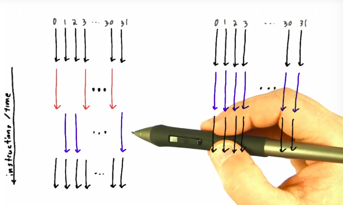
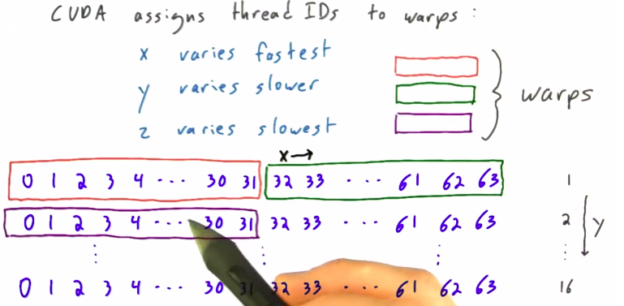
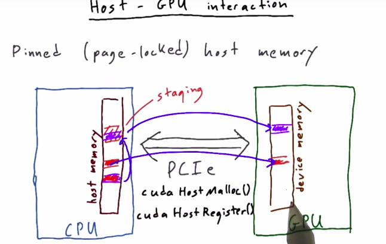
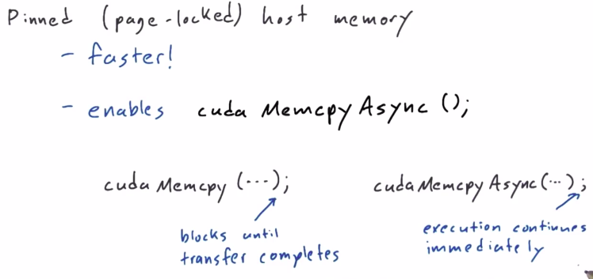
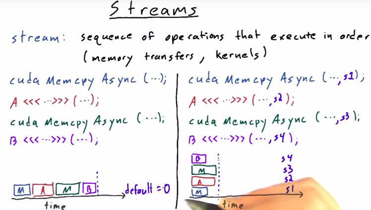
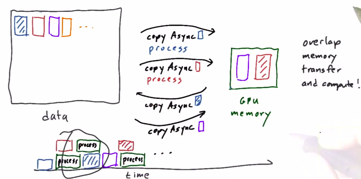
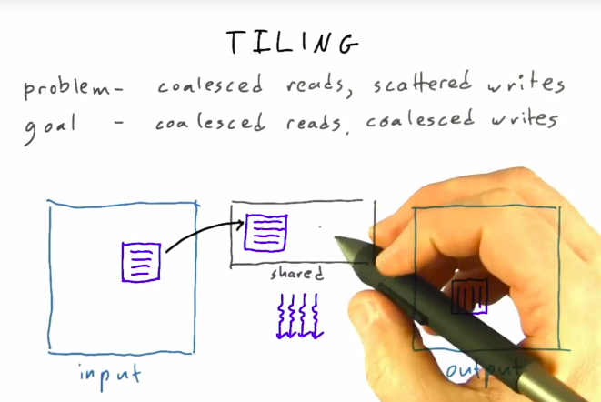
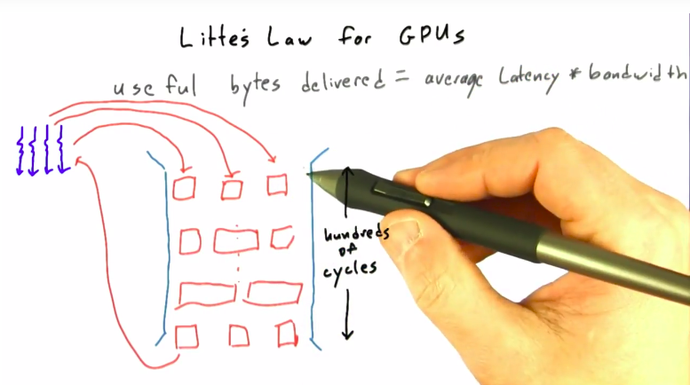

# Optimizing GPU Programs

**想要编写一个高效的GPU程序需要注意的几件事**

* **coalesce global memory accesses, **
  * 读写都要注意内存的连续
  * 因为每次访存都是以 chunk 的形式来的。
* **avoid thread divergence, **
  * (减少线程中的跳转操作。)
* **decrease time spent on memory operations**
  * 降低在内存访问上所消耗的时间
    * 可以将经常访问的数据移动到 shared-memory 上来实现


**arithmetic intensity**
$$
 = \frac{math}{memory}
$$

* math per memory， 每个 memory 读出来后，计算了多少次
* 越大越好


**优化的级别**

* 选择一个好的算法 
  * 选择一个 fundamentally parallel 的算法
* 遵循基本的 GPU 编程原则
  * coalescing **global** memory： 相邻的线程应该读写相邻的 global memory 区域
    * 对于 global memory 的原则。其它不用考虑
    * 目标是实现，coalesced **reads**, coalesced **writes**
  * use shared memory
* 架构级别上的优化
  * bank conflicts
  * optimizing register
* $\mu$-optimization at instruction level 
  * floating point
  * denorm hacks


## 代码优化流程


**代码优化流程：APOD**

* **Analyze**: Profile whole application 
  * where can it benefit
  * by how much?
* **Parallelize: ** 
  * Pick an approach
    * 找个好的 libraries
    * Programming Language
  * Pick an algorithm
    * 这个非常重要
* **Optimize**
  * profile-driven optimization
  * Don't optimize in a vacuum
  * 在真实环境中测试！！！！
* **Deploy**


**Weak vs Strong Scaling**

> Serial program solves problem size P in time T
>
> ex: fold a protein in an hour

* weak scaling: run a larger problem (or more)
  * fold a **bigger** protein, or more small ones
  * solution size varies with fixed problem size per core
* Strong Scaling: run a problem faster
  * fold the same protein **in a minute**
  * solution size varies with fixed total problem size


**在 analyze 过程需要了解什么**

* understanding hot-spots
  * don't rely on intuition
  * 执行 profiler，他会告诉你每个函数占用的时间的。
  * 并行机制带来的加速 **受限于** 被并行部分在程序中所占用的比例。

$$
\max speedup = \frac{1}{1-p}
$$

* understanding **strong scaling** VS **weak scaling**


**Parallelize 应该注意的**

* 最大化的并行并不一定带来最优的结果。granularity coarsening
* memory： 花费在 读写 内存的时间。
  * 如果能达到 40-60% 的最大带宽，okey
  * 60-75% 的最大带宽，good
  * \> 75% 的最大带宽， excellent
  * 永远不会达到最高带宽。
* compute：花费在 计算 读进来的数据的时间。


**deviceQuery**

* GPU clock rate:  （.9GHz）GPU 的计算速度
* Memory clock rate：（2500MHz） 内存的速度
* Memory bus width： （128-bit），每次 clock cycle，内存中有多少 bit 被转移。


**带宽（band width）**

> GB/s, 每秒传送多少数据

* 理论最高带宽的计算：memory clock rate * memory bus width
* 真实带宽的计算： 这段代码的数据 transfer 的数量 / 代码执行的时间。
  * 计算数据 transfer 数量的时候不要忘记 不仅考虑读，也要考虑写哦。


**Occupancy**

* 一个 SM 上的资源
  * thread blocks： 最多8个
  * threads：最多可以运行 1536/2048 个线程（逻辑上）
  * registers for all threads： 65536 个
  * bytes of shared memory： 16KB-48KB


**如何影响 Occupancy**

> 增加 Occupancy 可能会有帮助，也可能没有帮助
>
> exposes more parallelism, transactions in flight
>
> may force GPU to run less efficiently

* 控制 使用的 shared_memory 的大小
* 更改 threads，blocks 的数量
* compilation options to control register usage.


**如何减小 barrier 的影响**

* 减少 block 中的线程数
* 增加 SM 中 Block 的数量？？？？？？？？？？


## Optimizing Compute Performance

> Goal: maximize useful computation/second

* minimize time waiting at barriers
  * 减少 thread block 中的线程数量
* minimize thread divergence
  * Avoid branchy code
    * lots of if, switch statements ?
    * adjacent threads likely to take different paths?
    * Try to restructure
  * Beware large imbalance in thread workloads
    * look at loops, recursive calls
    * Try  to restructure


**什么叫 thread divergence**

在GPU中，一个 **warp** 的 threads 在同一时间执行相同的指令。但是如果一个 kernel 代码中 if...else ...指令的话。**一个 warp 中的 threads 可能一部分执行 if-branch，一部执行 else-branch**。但是 warp 中的 threads 又必须在同一时刻执行相同的指令，所以 硬件自动的 deactivate 一些线程。先执行 if-branch 的线程，再执行 else-branch 的线程，这样就会浪费时间。



* 只有一个 if-else，称作 two-way branch divergence



* 上图表示了 cuda 如何 是根据什么顺序将 threads warp 起来的。
* switch 语句也和 if-else 一样。


**Loops Divergence**

* 这个要考虑的是，一个 block 需要多少时间执行完
* 如果有 loop 的话，warp 的执行的时间等于 warp 中线程的最长时间。


**Assorted math optimizations**

* use double precision only when you mean it

  * > fp64 > fp32
    >
    > float a = b + 2.5; ? float a = b+2.5f;

* use intrinsics when possible

  * `__sine(), __cos()..`, 使用 built-in function


## HOST GPU interaction

* PCIe can transfer memory that has been **page locked or pinned**, and i keeps a special chunk of pinned host memory set aside for this purpose.
* 当我们想将 Host 上的一块 memory 拷贝到 GPU 上去的时候，CUDA 的操作流程如下
  * Host memory --> Host pinned memory --(PCIe)--> GPU memory
* 可以在 Host 上手动分配 pinned memory，这样就会省下第一步的 时间



**手动分配 pinned memory 有两个好处**

* 更快，省去了 host memory ---> host pinned memory 的转移时间
* 可以使用 cudaMemcpyAsync() , 可以进行异步数据传输了
  * let's the CPU keep working while the memory transfer completes.



## Streams

> sequence of operations that execute **in order **, (memory transfers, kernels)



```c++
cudaStream_t s;        // 声明
cudaStreamCreate(&s);  // 创建
cudaStreamDestroy(s);  // 销毁
```


**需要注意的一点是**

```c++
cudaMemcpyAsync(&d_arr1, &h_arr1, numbytes, cudaH2D, s1);
A<<<1, 128, s2>>>(d_arr1);
// 如果每个算法都是 1 s 钟可以结束，那么以上程序 1s 中就可以执行完
// 但是 结果是错误的！！！
```



**Advantage of Streams**

* overlap memory & compute (资源充足的情况下)
* Help fill GPU with smaller kernels
  * many problems with limited parallelism
  * computations with narrow phases (reduce)
* Caveats ---> see CUDA Programming Guide
  * Streams    Events


## 一个 Demo

一个矩阵 transpose 的代码，如果每个点一个线程的话，会导致

* coalesced reads, scattered writes

问题，为了遵循 coalesced global memory access 原则，应该怎么改呢？



* 一个 thread-block 处理一个 tile
* ​


**Little's LAW**

> how to utilize all memory bandwidth
>
> Little's LAW:  **useful of bytes delivered = average latency of each transaction * bandwidth**



* 将 memory 机制看作一个 pipe， pipe是 **又长又宽** 
* **长** 是因为，需要多个 clock cycle 才能将数据读出来
* **宽** 允许同一时间可以处理多个 **线程** 的请求。


**对于 memory ，我们能怎么 干呢？**

* 让 内存的 pipe 变得 **更宽**。


## 总结

* APOD
* measure & improve **memory bandwidth**
  * assure sufficient occupancy
  * coalesce global memory accesses
  * Minimize latency between accesses, **barrier 问题**
* minimize thread divergence
  * 注意 warp 的问题
  * avoid branchy code
  * avoid thread workload imbalance , for loop 的问题
* consider fast math, 
  * 内置的 函数
  * 使用 double precision on purpose
* 使用 Streams
  * overlap computation and CPU-GPU memory transfer

## Glossary

* warp: **set of threads** that **execute the same instruction**  **at a time**
* SIMD: single instruction, multiple data