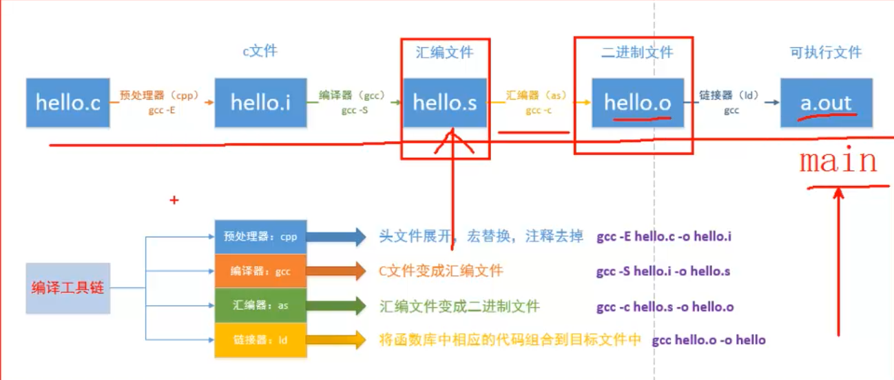

# 闲谈





## gcc(g++) 命令

```shell
gcc -o test test.cc #-o 指定输出文件的名字,否则默认为 a.out, 生成可执行文件, 编译链接一体执行
gcc -o test test.cc -I/usr/local/include #-I 参数指定 include 文件夹, 为啥-I后面没有空格,很是纠结

```

**上述的编译部分分四个阶段进行**

* 预处理： `gcc -E test.c -o test.i`
* 编译为汇编代码：`gcc -S test.i -o test.s`
* 搞成机器码：`gcc -c test.s -o test.o`
* 链接：`gcc test.o -o test`


**在 GCC 命令中指定宏**

* `gcc test.c -o test -D DEBUG`: 在编译时给 `test.c` 文件中定义了一个宏
* 编译时是否优化代码:三个等级
  * `-O`:  `-O0` :不优化, `-O3`:使劲优化
* `-Wall`: 声明参数又不使用,会给出信息
* `-g`: 编译的时候加一些调试信息, 使用 `gdb` 调试的时候有用


## 环境变量

* `windows` 中到的 `path` 与 `linux`中的 `PATH` (windows对大小写不敏感，linux对大小写敏感)
  * 系统的环境变量：当系统的接口接收到一个程序启动命令时，除了在挡墙的目录下找那个可执行的文件以外，还可能需要到`PATH(linux), path(windows)`指定的路径寻找。

## GCC 程序环境变量

### include 搜索路径

* 当我们`#include "headfile.h"` 时，搜索顺序为：
  * 当前目录
  * 搜索 `-I` 参数指定的目录: `gcc main.c -I headDir -o main`
  * 搜索 `g++` 环境变量`CPLUS_INCLUDE_PATH`（`C程序使用的是C_INCLUDE_PATH`）
  * 最后搜索 `g++` 的内定目录 (`/usr/include,/usr/local/include,/usr/lib/gcc/x86_64-redhat-linux/4.1.1/include`)
  * 找到了就不再找了。


* 当我们`#include <headfile.h>` 时，搜索顺序为：
  * 搜索 `-I` 参数指定的目录
  * 搜索 `g++` 环境变量`CPLUS_INCLUDE_PATH`（`C程序使用的是C_INCLUDE_PATH`）
  * 最后搜索 `g++` 的内定目录 (`/usr/include,/usr/local/include,/usr/lib/gcc/x86_64-redhat-linux/4.1.1/include`)
  * 找到了就不再找了。


### 库搜索路径

[此部分来自http://www.cnblogs.com/panfeng412/archive/2011/10/20/library_path-and-ld_library_path.html ](http://www.cnblogs.com/panfeng412/archive/2011/10/20/library_path-and-ld_library_path.html)

**改正了其错误地方**

**链接**。这时候涉及到的环境变量：

* LIBRARY_PATH

**程序运行的时候**。这时候涉及到的环境变量：

* LD_LIBRARY_PATH

### LIBRARY_PATH

LIBRARY_PATH环境变量用于在**程序链接期间**查找**动态/静态链接库时**指定查找共享库的路径，例如，指定g++编译需要用到的动态/静态链接库的目录。设置方法如下（其中，LIBDIR1和LIBDIR2为两个库目录）：

```shell
export LIBRARY_PATH=LIBDIR1:LIBDIR2:$LIBRARY_PATH
```


## LD_LIBRARY_PATH

LD_LIBRARY_PATH环境变量用于在**程序加载运行期间**查找**动态链接库时**指定除了系统默认路径之外的其他路径，注意，LD_LIBRARY_PATH中指定的路径会在系统默认路径之前进行查找。设置方法如下（其中，LIBDIR1和LIBDIR2为两个库目录）：

```shell
export LD_LIBRARY_PATH=LIBDIR1:LIBDIR2:$LD_LIBRARY_PATH
```


### 区别与使用

开发时，设置LIBRARY_PATH，以便gcc能够找到**链接时**需要的动态/静态链接库。

发布时，设置LD_LIBRARY_PATH，以便程序**加载运行时**能够自动找到需要的动态链接库。


As pointed below, your libraries can be static or shared. If it is static then the code is copied over into your program and you don't need to search for the library after your program is compiled and linked. If your library is shared then it needs to be dynamically linked to your program and that's when `LD_LIBRARY_PATH` comes into play.


## 动态链接库与静态链接库

* windows 上
  * 静态链接库(.lib)
  * 动态链接库 (.dll)
* linux 上
  - 静态链接库(.a)
  - 动态链接库 (.so): **命名规范**: `lib[Name].so`
  - linux下**静态链接库命名规范** : "lib[you_library_name].a"


**linux 制作静态库**

* `.c` ---> `.o` 文件: `gcc -c test.c -o test.o`
* 将生成的 `.o` 文件打包: `ar rcs libName.a file1.o file2.o file3.0`
* 发布静态库: 头文件和 静态库

**linux 使用静态库: 两种方式**

* `gcc main.c libName1.a libName2.a -o main`: 编译时和 文件名一起指定就好 
* `gcc main.c -L lib -l Name1 -o main`:  这种方法也可以
  * `-L` : 指定静态库的目录
  * `-l`: 指定使用哪个静态库
* 使用静态库的时候, 打包到可执行程序中 的最小单位是 `.o` ,并不是 `.a`

**静态库优缺点**

* 优点 
  * 发布可执行程序的时候, 不需要提供对应的库, 因为已经打包到应用程序中了
  * 加载库 的速度快, 因为已经在应用程序中了
* 缺点
  * 导致应用程序体积变大
  * 库一旦发生改变,需要重新编译程序


**linux 制作动态库**

* `.c` ---> `.o`: 生成与位置无关的代码: `gcc -fPIC -c *.c` 
* `.o` 文件打包成共享包: `gcc -shared -o libName.so name1.o name2.o`
* 发布: 头文件和 `.so` 文件发布

**linux 使用动态库: .c 和动态库生成一个可执行文件, 和 静态库一样,两种方式**

* `gcc main.c libName.so -o app`
* `gcc main.c -L libDir -l Name -o app`
* 应用程序执行的时候,有一个程序帮助加载动态库,这个程序有个动态库搜索路径.


**动态库优缺点**

* 优点
  * 可执行程序体积小
  * 动态库如果更新, 不需要重新编译程序
* 缺点
  * 发布应用程序的时候,需要提供相应的动态库
  * 应用程序执行过程中加载, 速度会慢一些


```shell
ldd 应用程序名 # 会列出应用程序运行时所需要的所有动态库
```


## 可能碰到的问题

* `-I`指令指定的 包含路径 使用`#include <header>` 的方式可能依旧找不到，可以尝试 `#include "header.hpp"` 


## Netbeans开发caffe

* 创建好项目
* 右击项目名字
* 左击属性
* `Build` --> `c++ complier` --> `include directories` (把caffe的路径填进去 "caffe/include")，把CUDA的include也放进去
* Linker --> libraries (把libraries指定好！！)
  * `add library file` --> `libcaffe.a` 或者 `libcaffe.so`的绝对路径
  * `add library`  --> `boost_system`


## 设置动态链接库路径方法

* 环境变量LD_LIBRARY_PATH指定的动态库搜索路径(修改/etc/profile 文件中的 `LD_LIBRARY_PATH`)
* 在 `/etc/ld.so.conf.d/` 中新添加一个文件 `your.conf`
  * 然后在文件中添加动态库路径
  * 更新: `sudo ldconfig -v` 
* 默认的动态库搜索路径`/lib, /usr/lib`
* 查找顺序
  * `LD_LIBRARY_PATH`
  * ​


## g++ 编译opencv 程序

```shell
g++ -o test test.cc  `pkg-config --cflags --libs opencv` # 最后的那个一定要用上,要不然就日狗了.
```

[来自](https://stackoverflow.com/questions/31634757/how-to-correct-undefined-reference-error-in-compiling-opencv)


## 问题总结

* cannot find -lcaffe

## 参考资料

[http://www.cnblogs.com/panfeng412/archive/2011/10/20/library_path-and-ld_library_path.html](http://www.cnblogs.com/panfeng412/archive/2011/10/20/library_path-and-ld_library_path.html)

[https://stackoverflow.com/questions/4250624/ld-library-path-vs-library-path](https://stackoverflow.com/questions/4250624/ld-library-path-vs-library-path)