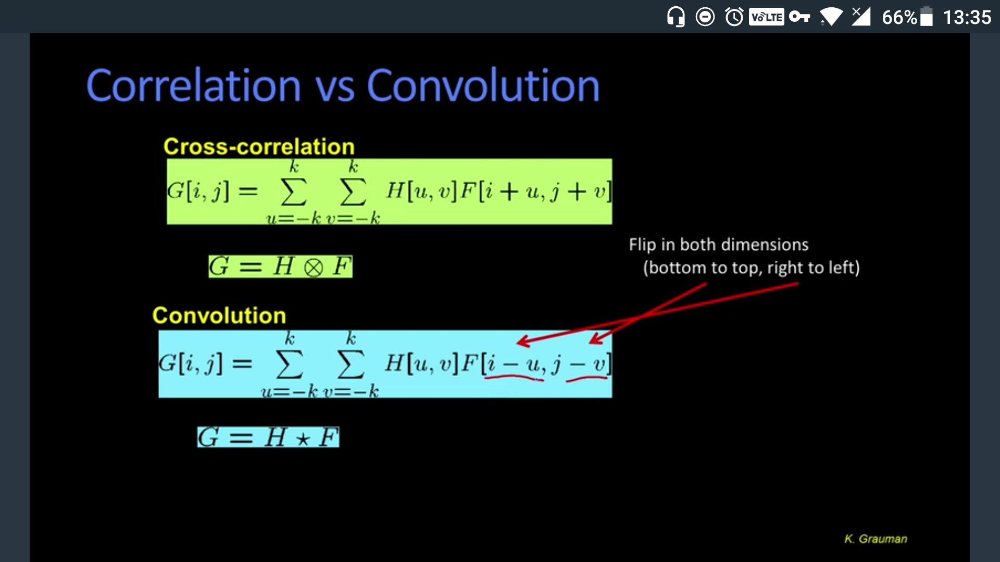
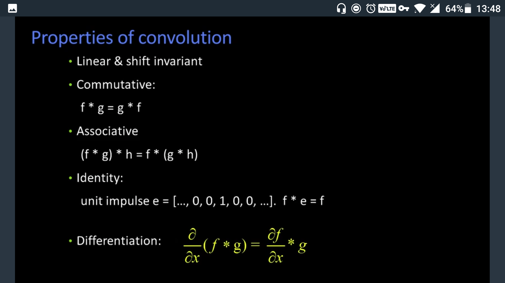

# Linear and Convolutional

## Linear

* H(f1+f2) = H(f1)+H(f2)
* H(a*f1) = a*H(f1)

## cross correlation & convolutional

<center></center>
如果核为对称的话，`cross correlation = convolutional`

## shift invariant

## properties of convolutional
<center></center>

**卷积具有 Separability**

## 在卷积的时候，如何处理边界问题

* FULL
* SAME
* VALID

## What about near the edge

* clip filter(black): assume the outside of edage is black
* wrap around:the edage is continous
* copy edge: just replicate the edge
* reflect across edge: reflect the image out.

In new matlab

* imfilter(f, g, 0)
* imfilter(f, g, "circular")
* imfilter(f, g, "replicate")
* imfilter(f, g, "symmetric")

**要搞清卷积或者cross-correlation做了啥， 要搞清楚`参考点`**

一个intensity放大两倍的图像减去一个模糊图像，会得到一个更加sharper的图像。

## Unsharp Mask

## Filter

* Gaussian。 模糊
* Linear。
* Median。 保存边界，Salt and pepper 用这个Filter

```
%% salt & pepper noise
noise_img = imnoise(img, "salt & pepper", 0.02);
midian_filtered = medfilt2(noise_img);
```
