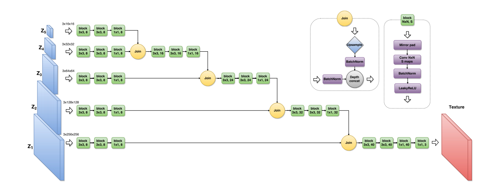
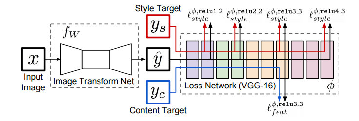
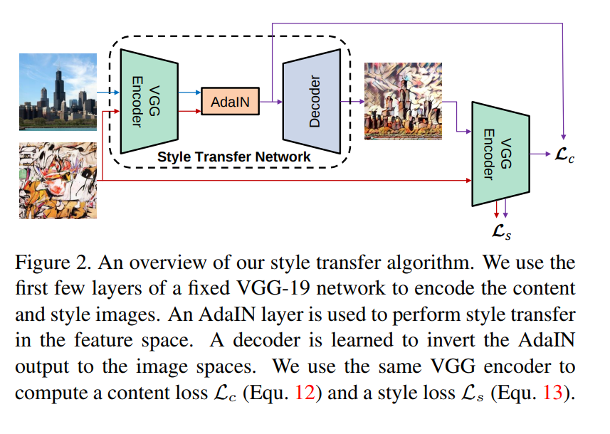

# neural style transfer 总结

三个阶段：

* 迭代优化
* feed-forward ，但是 一个网络只能代表一个 style
* feed-forward，一个网络，任意 style


## Image Style Transfer Using Convolutional Neural Networks (2016) CVPR 

* 迭代优化


**如何描述 image 的 content**

* 神经网络中间层的 feature map

```python
x : [num_channel, height, width]
```


**如何描述 image 的 style**

* 神经网络中间层的 feature map 做些操作
* style 不需要位置信息，操作需要 消除掉位置信息。

```python
x : [num_channel, height, width] 

x = x.view(num_channel, -1)
style = torch.matmul(x, x.transpose(0,1))
```


**loss**

```python
# content loss
c_loss = torch.mean((content_pred - content_target)**2)
# style loss
s_loss = torch.mean((style_pred-style_target)**2)
```


**总 loss**

- `content_loss + style_loss`


**流程：**

* 将 style-image输入神经网络，计算 style_target
* 将 content-image 输入神经网络，计算 content_target
* 随机噪声输入网络，计算 content_loss 和 style_loss 不停优化 随机噪声


## Texture Networks: Feed-forward Synthesis of Textures and Stylized Images (2016) ICML

* 一个网络，一个 style， `feed-forward` 的方式 进行 style-transfer





**使用GAN架构**

* `D` : 预训练的 `CNN` ，不更新！！


**做 texture synthesis 时不用 content loss**

**做 style transfer 时候，用 content loss**


## Perceptual Losses for Real-Time Style Transfer and Super-Resolution (2016) ECCV

* 一个网络，一个 style

**没有用 GAN， 直接训练出一个 transfer 网络**




**loss 函数**


## StyleBank: An explicit Representation for Neural Image Style Transfer (CVPR 2017)

* arbitrary style transfer

搞出了一个 `StyleBank`， 里面有很多 `Style`， 风格迁移的时候 从 `StyleBank` 中挑出 特定的 `Style`与 图片的 隐层表示卷积就 `OK` 咯。


**贡献有：**

* 显式的 style representation
* region-based style transfer : 如何做到的？


**方法**

* `StyleBank` 由 多个 `FilterBank` 构成
* 一个`FilterBank` 代表一种风格


**和 Perceptual 那篇文章很像**


## Arbitrary Style Transfer in Real-time with Adaptive Instance Normalization (2017) ICCV

* feed-forward 

**能够表示 style 不仅仅是 gram 矩阵，还可以是 feature map 的均值和方差。。。。**

**通过改变 feature map 的均值和方差，也可以改变 style**





## Controlling Perceptual Factors in Neural Style Transfer (CVPR 2017)


**以前方法存在的问题**

* 将 地面的 纹理 用在了 天空上。。

**统计信息中可能包含啥**

* 不同区域的不同的 style，例如，天空和 地面的 style 是不一样的
* 调色板
* 细粒度的 空间结构 ： 比如 brush stroke shape（笔触效果）
* 粗粒度的 空间结构：比如 arrangements of stroke。

**作者将 style 分解成了以下部分**

* style in different spatial regions
* color
* luminance
* across spatial scales


**spatial control**

* control which region of style image is used to stylize each region in the content image.


## 疑问？

* 为什么 style 那么表示是可行的？
* style transfer 貌似都没有用 bn。

