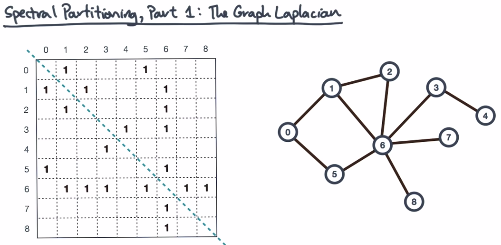
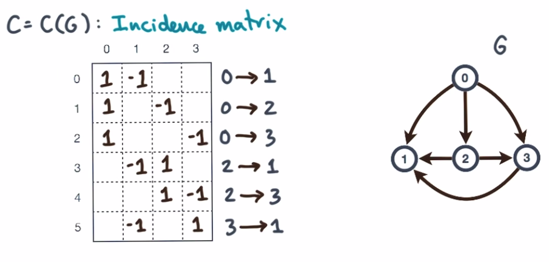
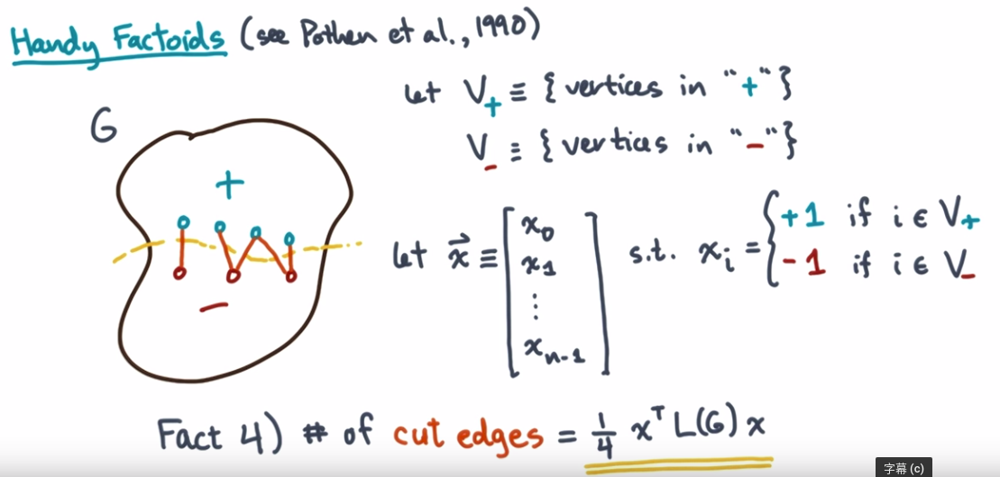
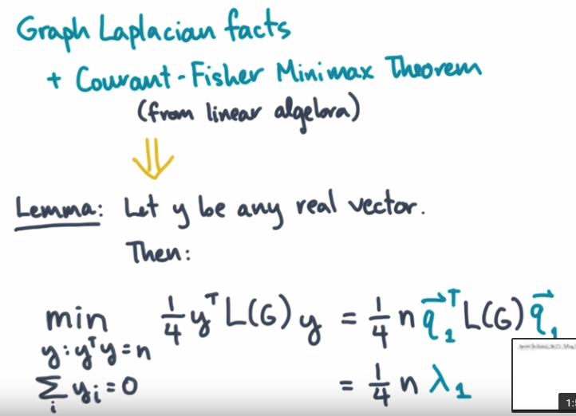

# Materials

[谱聚类（spectral clustering）原理总结](https://www.cnblogs.com/pinard/p/6221564.html)

[http://nlp.csai.tsinghua.edu.cn/~lzy/talks/adl2015.pdf](http://nlp.csai.tsinghua.edu.cn/~lzy/talks/adl2015.pdf)

[A Short Tutorial on Graph Laplacians, Laplacian Embedding, and Spectral Clustering](https://csustan.csustan.edu/~tom/Clustering/GraphLaplacian-tutorial.pdf)

[WWW-18 Tutorial, Representation Learning on Networks](http://snap.stanford.edu/proj/embeddings-www/)

[https://tkipf.github.io/graph-convolutional-networks/](https://tkipf.github.io/graph-convolutional-networks/)

[https://sites.google.com/site/pkujiantang/home/kdd17-tutorial](https://sites.google.com/site/pkujiantang/home/kdd17-tutorial)

[http://www.ipam.ucla.edu/programs/workshops/new-deep-learning-techniques/?tab=schedule](http://www.ipam.ucla.edu/programs/workshops/new-deep-learning-techniques/?tab=schedule)

[http://www.ntu.edu.sg/home/xbresson/pdf/talk_xbresson_gcnn.pdf](http://www.ntu.edu.sg/home/xbresson/pdf/talk_xbresson_gcnn.pdf)

[turorial of spectral clusting](https://www.cs.cmu.edu/~aarti/Class/10701/readings/Luxburg06_TR.pdf)

[Lectures on spectral graph theory](http://120.52.51.19/www.math.ucsd.edu/~fan/cbms.pdf)

[https://simons.berkeley.edu/talks/spectral-graph-theory](https://simons.berkeley.edu/talks/spectral-graph-theory)

[https://courses.cs.washington.edu/courses/cse521/16sp/521-lecture-12.pdf](https://courses.cs.washington.edu/courses/cse521/16sp/521-lecture-12.pdf)
[http://theory.stanford.edu/~tim/s17/l/l11.pdf](http://theory.stanford.edu/~tim/s17/l/l11.pdf)

[https://www.quora.com/Are-there-any-good-video-lectures-to-catch-up-spectral-graph-theory](https://www.quora.com/Are-there-any-good-video-lectures-to-catch-up-spectral-graph-theory)

[https://www.cse.iitk.ac.in/users/rmittal/prev_course/s18/reports/11intro_sgt.pdf](https://www.cse.iitk.ac.in/users/rmittal/prev_course/s18/reports/11intro_sgt.pdf)

[https://www.osti.gov/servlets/purl/1295693](https://www.osti.gov/servlets/purl/1295693)

[http://aris.me/contents/teaching/data-mining-2016/slides/spectral.pdf](http://aris.me/contents/teaching/data-mining-2016/slides/spectral.pdf)

[http://www.maths.nuigalway.ie/~rquinlan/teaching/spectralgraphtheory.pdf](http://www.maths.nuigalway.ie/~rquinlan/teaching/spectralgraphtheory.pdf)

## Spectral Graph Theory

[https://www.youtube.com/watch?v=rVnOANM0oJE](https://www.youtube.com/watch?v=rVnOANM0oJE)

* linear algebraic view of graphs

**adjacency matrix**

* 一个 $N*N$ 的矩阵，$N$ 为 vertex 的个数

**Incidence Matrix**

* $M*N$ 矩阵，N 为 vertex 个数 M为 edge 个数

**Graph Laplacian**

* $L(G)=C^TC$ , 自己算一下可以发现
* Graph Laplacian 给出了一个 原graph的无向图形式。
* 对角线上是 无向图形式的 vertex 的度，非对角线上是当前 vertex 和哪个vertex 有连接（用-1表示的）
* 也可以看出： $L(G)=D-W$ : $D$ 为vertex的degree构成的对角线矩阵，$W$ 是邻接矩阵

**一些结论**

* $L(G)$ 是对称矩阵
* $L(G)$ 有 
  * real-valued, non-negative eigenvalue
  * real-valued, orthogonal eigenvector
* 当且仅当 $L(G)$ 有 $K$ 个值为0的 eigenvalues 时 图 $G$ 有 $K$ 个连接
  * 这个结论告诉我们 Graph Laplacian 的 eigenvalue 的值能够告诉我们一些Graph中vertex的连接情况
  * eigenvector：表示谱中的成分。对于光谱来说就是7种颜色
  * eigenvalue：是谱中成分的值。对于光谱来说就是7中颜色各个的强度
* 如果一个图被分割成 两个部分。$V_+, V_-$ 这个是图语言描述，如果用线性代数语言描述的话就下面的 $\overrightarrow x$ ，这时，分割策略切到了几条边可以用以下公式表示 $\frac{1}{4}x^TL(G)x$ , 通过优化这个目标函数，可以得到最优的切割。

**Lemma**

* $\overrightarrow q_1$ : 第二小的特征值对应的特征向量

# Spectral Graph Theory and Fourier Transform

**符号表达**

* 带 $\hat ?$ 的 是频域表示，不带的是时域表示 

**假设信号 $f(t)$**

傅立叶变换( Fourier Transform) 的公式为
$$
\hat f(\xi):=\int_{\mathbb R} f(t)e^{-2\pi i\xi t} dt
$$

* 积分形式可以协程矩阵乘的形式：$[f(t_0), f(t_1), ...] * [e^{-2\pi i\xi t_0},e^{-2\pi i\xi t_0}, ...]^T$ 
* 而矩阵乘的另一个解释就是投影，所以 $\hat f(\xi)$ 就可以看作是 $f(\mathbf t)$ 在 $e^{-2\pi i\xi \mathbf t}$ 上的投影值

逆变换的公式为：
$$
f(t)=\int_{\mathbb R} \hat f(\xi)e^{2\pi i\xi t} d\xi
$$
现在瞅一眼 $e^{2\pi i \xi t}$ 的性质
$$
-\Delta e^{2\pi i\xi t} = \frac{\partial^2 e^{2\pi i\xi t}}{\partial t^2} = (2\pi\xi)^2e^{2\pi i\xi t}
$$
这东西看起来像不像 矩阵中 eigenvalue 和 eigenvector 的定义？ $A\mathbf x=\lambda \mathbf x$ , 

* 所以 傅立叶变换中的 $e^{2\pi i\xi \mathbf t}$ 就可以看作 特征向量
* $(2\pi\xi)^2$ 就是特征值
* 反过来看也一样，矩阵的 **特征向量** 其实是 傅立叶变换中的 $e^{2\pi i\xi \mathbf t}$ 
* **矩阵的特征值** 就是  $(2\pi \xi)^2$ 
  * 可以看出，矩阵的特征值和 频率息息相关，成正比关系

这时候，如果将图的 Laplace Matrix 定义出来，就都清楚了：
$$
\begin{align}
L&=D-W \\
LU&=\Lambda U
\end{align}
$$

类似的，Graph Fourier Transform 就可以定义为
$$
\hat f(\lambda_l) = \sum_{i=1}^{N} f(i) \mathbf u_l^*(i)
$$
逆变换可以定义为
$$
f(i)=\sum_{l=0}^{N-1} \hat f(\lambda_l) \mathbf u_l(i)
$$

* $N$ : 图中 vertex 的数量
* $f(i)$ : 图中，i-vertex 的值（signal）是啥

仔细观察公式可以看出

* $\lambda_l$ ：其实可以看作频率的
* $\mathbf u_l\in \mathbb R^N$ ： **对应于 正弦波**（频率为 $\lambda_l$ ）， $\lambda_l$ 越大 $\mathbf u_l$ 振动就越快 。$\mathbf u_l$ 中的每个分量对应于图中的 每个 vertex。

## Filtering （滤波）

**傅立叶变换**

先看傅立叶变换的中的频域滤波
$$
\hat f_{out}(\xi) = \hat f_{in}(\xi)\hat h(\xi)
$$
变换到时域就成了（卷积）：
$$
f_{out}(t)=\int_{\mathbb R} f_{in}(\tau)h(t-\tau)d\tau =: (f_{int} *h)(t)
$$

**Graph  Fourier Transform**
$$
\hat f_{out}(\lambda_l) = \hat f_{in}(\lambda_l)\hat h(\lambda_l)
$$
转换到频域（利用逆变换的公式）：
$$
f_{out}(i) = \sum_{l=0}^{N-1} \hat f(\lambda_l)\hat h(\lambda_l) \mathbf u_l(i)
$$

#  Papers

## 一些理解

* GCN，实际上为不同的节点构建了不同的计算图。
