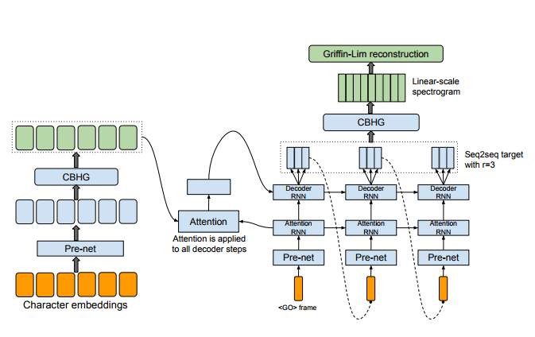
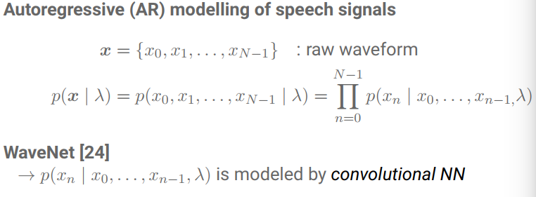

# TTS (Text To Speech)

**根据文本生成音频 (raw audio)**

**一个 tts 系统通常包含三个部分**

* text analysis fronted
* acoustic model
* audio synthesis

## Deep Voice

**text analysis**

* 文本序列转音素序列
* 输入："hello world"。输出："həˈlō wərld" 。

**acoustic model**

* 给定音素，输出声学特征，（`duration prediction` , `fundamental frequency` 等） 
* 输入："həˈlō wərld"， 输出：`duration prediction, fundamental frequency`
* ground truth label 怎么标：
  * duration prediction : **用 audio 和 音素训练一个语音识别模型(`CTC`, 此模型在inference阶段不使用)**，标签为 `<_, h>, <h, e>, ..` , 训练完之后，`<_, h>` 与 `<h, e>` 的距离作为 `h` 的持续时间。
  * fundamental frequency： 直接从音频中计算出来，在音素 duration 中计算出每个音素的 fundamental frequency

**audio synthesis**

* 给定声学特征和音素，合成音频（raw audio）。
* 使用 wave-net。

**特点**

* tts 每个模块都使用深度学习模型替换，灵活性和可扩展性优于传统方法。
* 缺点在于，三个模型独立，不能一起优化，会导致 loss 的累积。

## Tacotron

* 神经网络用作 text to spectrum 的变换，
* 然后用 griffin-lim 算法将 spectrogram 转换成 waveform。griffin-lim 算法无参数，不用学习。

**网络结构**

**CBHG结构：** 

**encoder**：pre-net + CBHG

**decoder**： content-based tanh attention decoder (输出 mel-spectrum)+ CBHG（输出 linear-spectrum） 

**vocoder** ：Griffin-Lim (heuristic 算法， 不用训练)(一个频谱转waveform 算法)

**content-based tanh attention decoder**

**问题：**

* 为什么使用 content-based tanh attention decoder？如果换成原始 attention 或者 self-attention 会怎么样。
* 频率谱够了吗？是否需要加点其它东西上去。

## Tacotron 2

## Wave Net

**将 speech signals 建模为 自回归模型（autoregressive models）**

**wavenet 网络的特点**

- causal dilated convolution: 
  - dilated : 可以捕捉 long-term dependency
  - causal : 满足 autoregressive 模型的特征
- gated convolution + residual + skip : 提供强有力的非线性支持。
- softmax at output : 分类而不是回归。

## Parallel Wave Net

**问题**

* 能否换个 sample 模型，感觉没有必要使用 normalizing flow（可以进行 density estimation，但是这里又不需要 density estimation）。

## Char2Wav

## 参考资料

[Deep Voice: Real-time Neural Text-to-Speech](http://cn.arxiv.org/pdf/1702.07825.pdf)

[oxford-cs-deepnlp-2017-lectures-text-to-speech](https://github.com/oxford-cs-deepnlp-2017/lectures/blob/master/Lecture%2010%20-%20Text%20to%20Speech.pdf)

[Generative Model-Based Text-to-Speech Synthesis](https://static.googleusercontent.com/media/research.google.com/en//pubs/archive/45882.pdf)