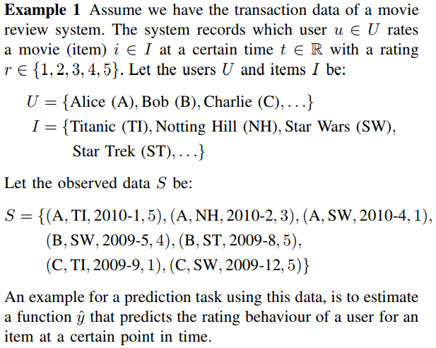
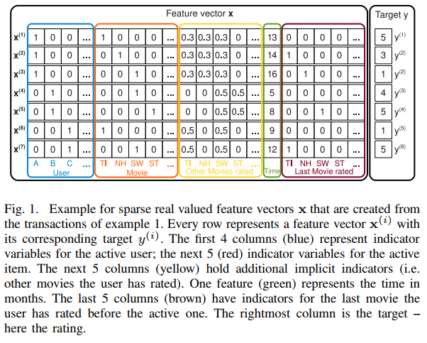
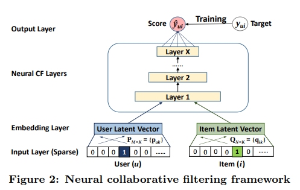
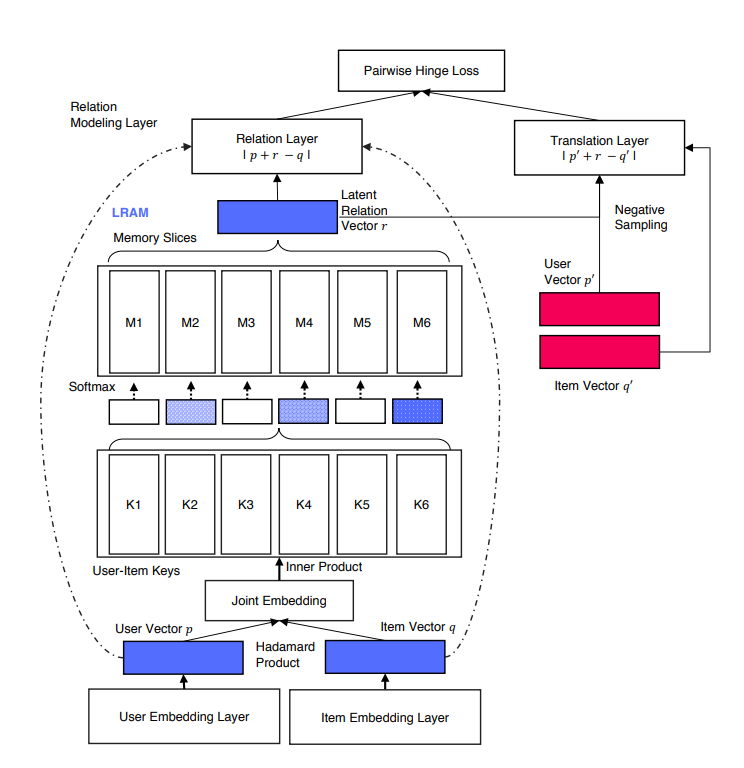
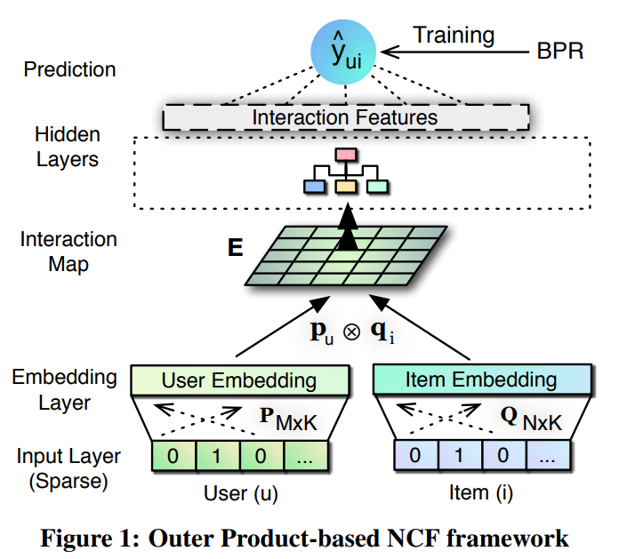

# 推荐系统论文总结

## 常用术语

* sparse data: 特征向量中的元素大部分是0,只有少数是其它值
* 为什么会 sparse：
  * One reason for huge sparsity is that the underlying problem deals with large categorical variable domains。对于 类别的特征，需要用 one hot 来表示，所以就稀疏了， 但是这个问题可以通过 embedding 来解决啊。
* 稀疏带来的问题：学习 特征之间的交互就比较困难
  * 比如 `ax+by+cz=y` : `x, y, z` 为特征值，`a, b, c` 是他们对应的系数，如果特征大部分为0, 即使多给几个这样的等式，也难以正确的估计出 `a,b,c` 所对应的值
* general preference

## 一些简单分类

* 数据 eshow, click, conversion
* 长期兴趣建模, 短期兴趣建模
* top-1 推荐 还是 top-k 推荐
  * 为啥要 top-k, top-k 和 top-1 推荐的方法有啥区别, 为什么会导致这种区别
* 

## Factorization Machine

$$
\hat y(x) = w_0+\sum_{i=1}^{N}w_ix_i + \sum_{i=1}^N\sum_{j=i+1}^N <\mathbf v_i,\mathbf v_j>x_ix_j
$$

* 将 $w_{ij}$ 分解为 $<\mathbf v_i,\mathbf v_j>$ 提高了泛化能力，因为 $w_{ij}$ 只有在$x_i, x_j$ 都不为0的时候才能学习此参数，但是对于 sparse data，这个两个特征同时不为0的概率又非常小。
* 分解了之后，$x_i \neq 0$ 的样本可以学习 $\mathbf v_i$ 参数，对于 $x_j$ 也一样，实现了解偶，好方法
* 一元特征不够用，需要引入多元特征，但是引入多元特征之后发现多元特征共现的次数非常少，所以搞出来了  FM

**疑问？**

* $x_i$ 代表的是一个field，还是只是输入向量的某一维？

  * 如果只是某一维，总感觉有点问题。。。（没有问题，就是 embedding）
  * 如果是一个 field，这个公式表示的又不像是那样。。。 amazing
    * 如果是 field，那么 field之间的交互如何定义，因为 field的 one-hot vector长度不一定相同。。。

**FM 就像 Embedding 一样**

* 每个人用一个 embedding 表示
* 每个电影用 3 个 embedding 表示
  * 表示 **active item** 的 embedding (此次要预测的 item 的 embedding)
  * 表示 item 评分的 embedding
  * 表示 对 此电影评分时（active item），上一次看了啥电影的 embedding
* 时间维度用一个 embedding 表示

----

* 这里需要注意的是，电影评分的 embedding 和 时间维度的 embedding
  * 电影评分：不同的电影会有不同的评分，一个电影会有多个评分。这里对 **电影-评分** 存在两种 embedding 方式。
    * 将 **电影-评分** 进行 embedding：这样就会有  $|Movies|*|RankLevels|$ 个 embedding
    * 将电影进行 embedding，评分仅对 embedding 的长度进行 rescale，这样就只有 $|Movies|$ 个 embedding 了。文中采用的就是这种方式。 这种简单的分解是不是有些问题，如果将 $RankLevel$ 也给 embedding 了，是不是更好。
  * 时间维度的也同理，
    * 对时间概念进行 embedding，然后具体时间的 embedding 是对时间概念embedding 的 rescale。
    * 这样进行处理没啥问题吗？

## DeepFM

* $V_i$ 解释成 embedding vector。
* 是不是需要 one-step further，把输入搞成 embedding 向量，然后再 FM？
  * （FM其实就是embedding，只是一个**建模了 low-order feature interaction 的模型** ，虽然可以建模 higher-order，但是复杂度就太大了。）
* 怎么定义 high-order interaction，由于 Neural Network可以模拟任何函数，当然 high-order了？ 但是实际上， heaven knows。。。。
  * higher-order interaction，多个特征存在直接交互。比如 order-2 的 FM，仅仅有两个特征之间的直接交互，order-10 的 FM，就可以看作 high-order interaction 了。
* 用 CNN 也可以建模 high-order 的特征交互吧
  * dilated cnn
  * deformable cnn ????

**关于此篇论文**

* FM 用来建模 low-order feature interactions （用来捕捉比较通用的信息）
* DNN 建模 high-order feature interactions（刻画更加细节的信息）

## Wide & Deep Learning for Recommender Systems

* Memorization of feature interactions through a wide set of cross-product feature transformations are effective and interpretable, while generalization requires more feature engineering effort.
* With less feature engineering, deep neural networks can generalize better to unseen feature combinations through low-dimensional dense embeddings learned for the sparse features.
* However, deep neural networks with embeddings can over-generalize and recommend less relevant items when the user-item interactions are sparse and high-rank. （意味着数据量量少，不足以训练出一个优秀的神经网络。）

**文中提到的 Memorization 和 Generalization**

* Memorization can be loosely defined as learning the frequent, co-occurrence of items or features and exploiting the correlation available in the historical data.
  * 因为 wide 部分模型能力小，会 under-fitting。所以只会记住 高频的一些特性
* Generalization， 对于出现频率不高的 pair 也会有自己的判断。但是由于 数据的 sparse 和 high-rank，导致训练数据不足，没法有效的学习出 正确的 embedding 表征，所以就会过拟合。

**wide**

* 输入部分是 raw input features 和 transformed features
  * raw input features ： `[性别，语言，年龄]`  

**deep**

* embedding 走起

## Item-Based Collaborative Filtering Recommendation Algorithms

**two steps**

* 计算相似性
* prediction computation

**Item相似性计算， 如何计算 i 和 j 的相似度**

* cosine based similarity
  * 需要 item 的向量表示

$$
sim(\mathbf i ,\mathbf j)=cos(\mathbf i ,\mathbf j)
$$

* Adjusted Cosine Similarity
  * 只需要评分矩阵就可以了
  * $R_{u,i}$, 表示 用户 $u$ 对物品 $i$ 的评分
  * 需要找到 $\mathbf i, \mathbf j$ 共现的 所有user
  * $\overline R_u$ 是用户 $u$ 评分的均值，这个是为了消除 不同用户打分标准不同的影响

$$
sim(\mathbf i, \mathbf j) = \frac {\sum_{u\in U}(R_{u,i}-\overline R_u)(R_{u,j}-\overline R_u)}{\sqrt{\sum_{u\in U}(R_{u,i}-\overline R_u})^2{\sqrt{\sum_{u\in U}(R_{u,j}-\overline R_u})^2}}
$$

**评分预测**
$$
P_{u, i} = \frac {\sum _{all-similar-items, N}(s_{i,N}*R_{u,N})}{\sum _{all-similar-items, N}(|s_{i,N}|)}
$$

* 目标是计算 用户 $u$ 对 item $i$ 的评分
* 找到和所有 $i$ 相似的 items,用上面计算的相似性，和用户的评分计算 $i$ 的得分。

## Neural Collaborative Filtering (2017)

* user embedding
* item embedding
* 将 user 和 item 的交互从 inner product 换成 神经网络
  * 神经网络有更强的函数拟合能力

* 此文章关注点是在  implicit feedback（看或不看，看多久）上，而不是在 explicit feedback（rating，review）上

**关于数据**

* user-item 交互矩阵 如果 user（$u$） 和 item ($i$) 有交互，则 $y_{u,i}=1$ 否则为 0
  * $y_{u,i}=1$ 并不意味着，$u$ 喜欢 $i$，同样 $y_{u,i}=0$ 也并不意味着 $u$ 不喜欢 $i$
  * 缺乏 negative-sample，negative-sample问题如何解决？
  * 也可以不这么打标签啊。具体业务具体实现
* negative-sample 问题如何解决
  * 采样 unobserved-data 作为负例
  * 如果是 pairwise-learning 的话，observed-data 的得分比 unobserved 的得分低就好

**loss函数**
$$
p(\mathcal Y, \mathcal Y^-) = \prod_{(u,i)\in\mathcal Y} \hat y_{u,i}\prod_{(u,j)\in\mathcal Y^-} (1-\hat y_{u,j})
$$

* $\mathcal Y$ : observed data
* $\mathcal Y^-$ : unobserved data
* mse 的 高斯分布假设很不合适，所以用这种方式来表示 loss
* 用 SGD 更新参数

## Attentive Collaborative Filtering: Multimedia Recommendation with item- and component- level attention (2017)

* 用户喜欢一段视频 或者 一个图片，可能仅仅是对 视频/图像 的一部分感兴趣。
* 可以达到更精确的特征刻画

## Latent Relational Metric Learning via Memory-based Attention for Collaborative Ranking (2018)

- instead of simple push-pull mechanisms between user and item pairs, we propose to learn **latent relations** that describe each user and item pairs
- Considering the **many-to-many nature** of the collaborative ranking problem, enforcing a good fit in vector space can be really challenging from a geometric perspective especially since the optimal point of **each user and item is now a single point in vector space.** 
  - 解释了为什么 push-pull user vector 和 item vector 不好。

* 提出了一个 memory 模块。假设用户 为 p，item 为 q
  * 如果 p 喜欢 q，那么 memory 模块计算 p-q （即：r）。
  * 如果 p 不喜欢 q，那么 memory 模块随便算算就好。
  * 训练过后，可以解释为，memory 模块记住了出现在训练集中的 user-item pair 之间的关系，没有出现在训练集中的 pair，memory 模块对他们的关系描述并不准确。
* 此模型能达到相似的user 的 embedding 在一块，相似的 item 的embedding 在一块吗？
  * 如果模型能力过强的话，会记住 训练集中的 pair，即使 user embedding 和 item embedding 随机初始化，在训练的时候不更新，此模型在训练集上也会表现很好。
  * memory 模块在学习 $f(p, q)=p-q$ ，但是 memory 模块并没有这么灵活，他仅仅是提供了一些 memory slice，希望模型能通过 memory slices 组合出来 $p-q$ 的值。**$p-q$** 是可以充满整个 **N维** 空间的，而 memory slices的组合只能充满一个 **M维** 子空间而已。
  * 所以此模型为了降低 loss，也会将 $p$ 和 $q$ 移动到一个子空间上。**移动的时候会形成聚簇？** 
    * 假设有两类用户，两个 item，一个 r，可以分析的确可以学习出来用户的聚簇。
    * 复杂情况就说不清了。。。。。

## Outer Product-based Neural Collaborative Filtering (2018)

聚焦到 user-embedding 和 item-embedding 上来

- 考虑 user-embedding 中的每个维度 和 item-embedding 中的每个维度之间的特征交互
- outer product 就有种 FM 的感觉了，又有些区别，FM还需要 user-embedding 自己的 cross-product。

## Personalized Top-N Sequential Recommendation via Convolutional Sequence Embedding （2018）

* modeling each user as a sequence of items interacted in the past and aims to predict top-N ranked items that a user will likely interact in a "near future"
* more recent items in sequence have a larger impact on the next item

**之前模型的缺点**

* markov model: 缺点来自于其假设，当前状态只和上一状态有关系

**CNN模型的好处**

* 引入 general preference
* 可以建模 1-gram, 2-gram, 3-gram ...

**模型**

* 对每个用户 $u$ , 取出用户的 general preference embedding
* 从用户的交互序列中读取
  * 取出 $L$ 个连续的 items 作为input，
  * 再取 $T$ 个作为 target
* 输出的激活是 sigmoid。ie：多 label 输出
* 对于整个数据集的 likelihood 可以用如下公式表达出来
  * $u$ : 表示 user
  * $C^u$ : 表示我们想要预测的 time-step的集合 {L+1, L+2, ...}
  * $S_t^u$ : 表示用户在 $t$ 时刻与 哪个 item 进行交互了
  * 论文中的公式有问题吧。。。。。。

$$
p(S|\Theta)=\prod_u \prod_{t\in C^u} \sigma(y_{S_t^u}^{(u,t)}) \prod_{j\ne S^u_t} (1-\sigma(y_j^{(u,t)}))
$$

## Session-Based Recommendations with Recurrent Neural Networks (2016)

## RealTime Personalization using embeddings for search ranking at airbnb

* 业务场景特点
  * 用户每次搜索 都有强烈的 目标驱动
  * 用户在一个 session 中的点击 具有强相关性, 
* 使用数据类型, click 和 conversion

**模型1 (短期兴趣建模, 使用 click session 的信息)**

* Skip-gram model for listing embeddings  
  * 用户的点击 session
    * booked session : 带有 booking 的 session
    * exploratory session : 不带有 booking 的 session
  * 用户 session  到 句子上的映射
    * session --> 句子
    * session 窗口 --> 句子窗口
  * 模型训练
    * booked session: 不仅预测上下文, 还预测最终的订阅
    * exploratory session: 仅预测上下文

**模型2(长期兴趣建模, 使用 booking session 的信息)**

* user-type & listing-type embeddings
* 

**如何处理冷启动**

* 使用 meta 信息找相似, 这个需要统计一下 cover 度

**其它**

* 数据稀疏 如何处理
  * 将特征分解成 独立的多个部分, 然后训练模型. Eg. 将user_id分解为user的一些基本属性, 使用属性表示人
* 长期兴趣的建模 如果 处理用户兴趣变化的问题
  * 

