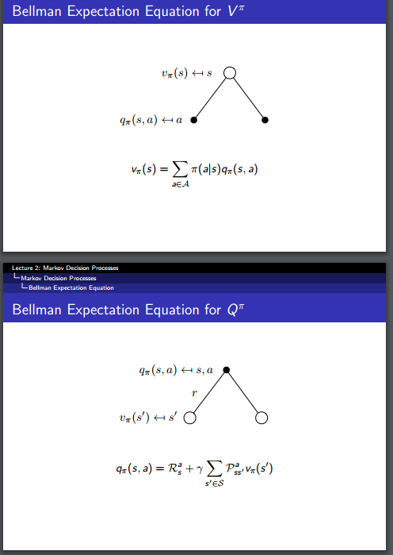
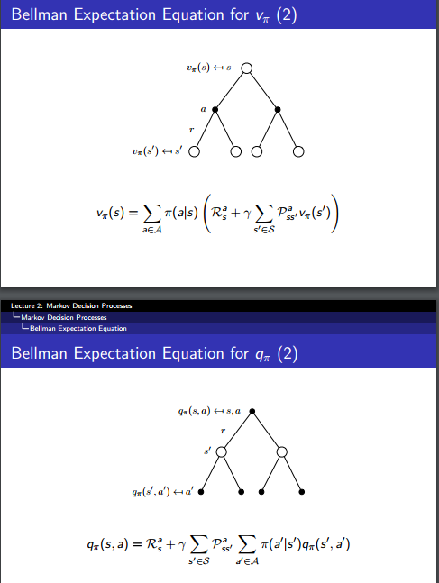
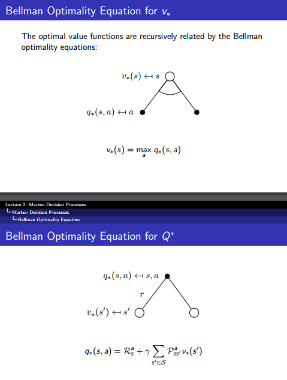
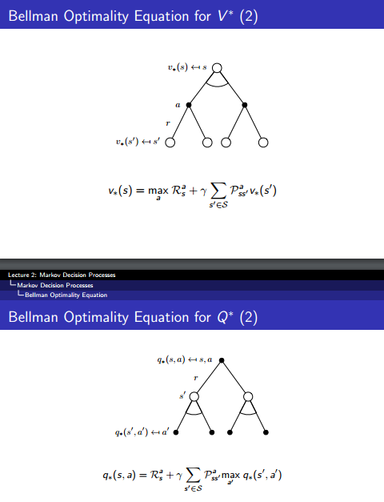
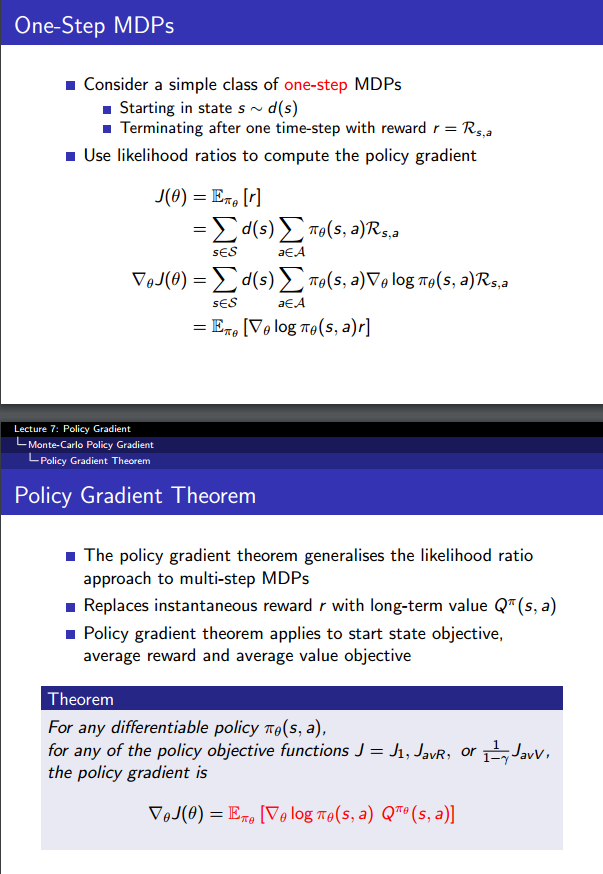
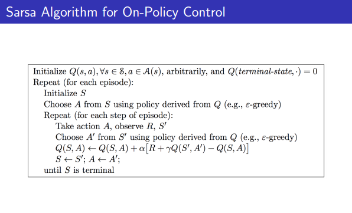
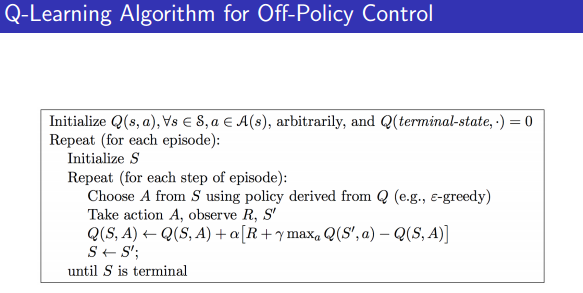
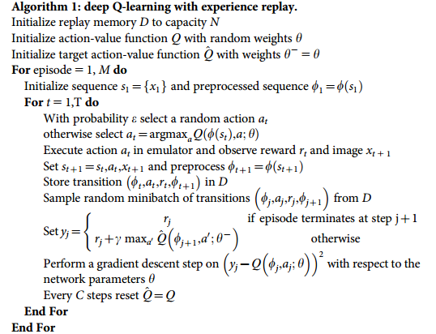
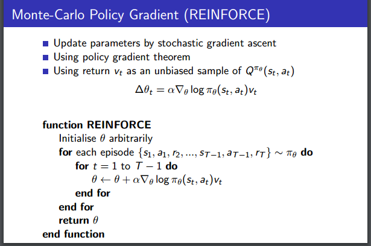

# 强化学习

**什么是强化学习：**（Berkely CS294）

监督学习：

 environment asks agents a question, and then **tells it the right answer.**

强化学习：

environment asks agents a question, and gives agent a **noisy score on its answer.**

通过对比可以看出：监督学习是告诉 agent 怎么做，强化学习是让 agent 学习怎么做。

**数学模型** （David Silver）

> environment state : 环境的表示，环境用来 pick the next observation/reward
>
> agent state : 强化学习算法就是基于这个 state 的，（agent 用来选择 action 的 state）

* MP (Markov Process)
* MDP  （agent state = environment state）
* POMDP （agent state != environment state）

**问题**

* reinforcement learning (model-free)
  * prediction :  **计算当前 policy 的 state-value / action-value**
  * control :  **得到最优的 policy**
* planning (model-based)
  * prediction
  * control

**planning 解决方法 model-based（dynamic programming）**

* prediction : 
  * policy evaluation （通过迭代法计算当前的 policy 的 state-value / action-value）
* control : 
  * policy iteration : (先 policy evaluation 再 policy improvement)
  * value iteration：

**reinforcement learning 解决方法， model-free**

* prediction (应该也是有 on-policy / off-policy 之分的)

  * MC （采样 trajectory 来估算 state-value / action-value），通过采样来 backup 
  * TD （通过 bootstrap 来估算 state-value / action-value）

* control

  * Value-function （先 prediction，然后在 policy improvement（epsilon-greedy））

    * MC (on-policy / off-policy)  
    * TD (on-policy / off-policy)
    * sarsa ：TD(0) + on-policy
    * q-learning：TD(0) + off-policy
    * DQN：TD(0) + off-policy (**DRL**)

  * policy gradient

    * stochastic
      * REINFORCE :  MC  (**DRL**)
    * continuous

  * actor-critic : 

    * stochastic:
      * REINFORCE with base line : TD(0)  (**DRL**)
      * ​
    * continuous
      * DDPG : policy-gradient + TD(0)  + off-policy (**DRL**)
      * A3C :  policy-gradient + TD(0) + on-policy   (**DRL**),   `这是个框架，可以把很多算法塞进去`
      * ​

**function approximation**

* 为什么提出

**Deep Reinforcement Learning**

> DL 做 function approximation

## Planning VS Learning

* Learning is going from experience to a policy
* planning is going from a model to a policy

## Planning   (Model-Based) 

> 已经有 model，如何用这个 model 搞事情

* prediction (给定一个 policy，计算在此 policy 情况下，Value 值)
* control （寻找最优 policy）

**MDP**

* 五元组 <$\mathcal S,\mathcal A,\mathcal P,\mathcal R,\gamma$>
* $\mathcal S$ : a finite set of states
* $\mathcal A$: a finite set of actions
* $\mathcal P$ : state transition probability matrix,  $\mathcal P_{ss'}^a = \mathbb P\Bigr[S_{t+1}=s'|S_t=s,A_t=a\Bigr]\tag{1}$
* $\mathcal R$ : reward function $\mathcal R_s^a = \mathbb E\Bigr[R_{t+1}|S_t=s,A_t=a\Bigr] \tag{2}$
* $\gamma$ : discount factor

**return**
$$
G_t=R_{t+1}+R_{t+2}+... = \sum_{l=0} \gamma^lR_{t+l+1} \tag{3}
$$
**trajectory** (路径)：$(s_0,a_0,r_1,s_1,a_1,r_2, ....s_{T-1},a_{T-1},r_T)$

**value function**

state-value function
$$
v_\pi = \mathbb E\Bigr[G_t|S_t=s\Bigr] \tag{4}
$$
action-value function
$$
q_\pi=\mathbb E\Bigr[G_t|S_t=s, A_t=a\Bigr] \tag{5}
$$
 **policy**
$$
\pi(a|s) = \mathbb P\Bigr[A_t=a|S_t=s\Bigr] \tag {6}
$$

**最优 policy**: 所有 policy 能获得最大 value 值的 policy
$$
v_\ast = \max_\pi v_\pi(s) \tag{7}
$$

$$
q_\ast = \max_\pi q_\pi(s,a) \tag{8}
$$

## Bellman Equation

**take one step look ahead**

**bellman expectation equation: for prediction**

**bellman optimality equation**

Planning-prediction ：Bellman expectation equation, dynamic programming

Planning-control : prediction +  policy improvement ($\varepsilon$-greedy)

## reinforcement learning (model-free)

* Monte-Carlo Learning
* Temporal-Difference Learning

**Monte-Carlo Learning**

* 看公式（4），是个 expected return，MC 用 empirical mean return 来估计这个值
* 具体做法是：
  * 用当前的 policy 采 $N$ 个 epoch，然后对 state 对应的 reward 求平均
  * 用这个均值来估计 expected return

$$
V(S_t) \leftarrow V(S_t)+\alpha\Bigr(G_t-V(S_t)\Bigr) \tag{9}
$$
(9) 是个 moving average 计算，$G_t$ 是 sampled return。

**Temporal-Difference Learning**

* update a guess towards a guess

$$
V(S_t)\leftarrow V(S_t)+\alpha \Bigr(R_{t+1}+\gamma V(S_{t+1})-V(S_t)\Bigr) \tag{10}
$$

* $R_{t+1}+\gamma V(S_{t+1})$  称为  TD-target
* $R_{t+1}+\gamma V(S_{t+1})-V(S_t)$ 称为 TD-error

**MC vs TD**

* 共同点
  * model-free

* 不同点
  * MC
    * 环境需要是 episodic 的，不是 episodic (terminating) 没法用
  * TD
    * 环境不需要是 episodic 的 （continuing environment）

以上介绍的是，prediction（policy evaluation）

如何 control 呢？

* policy evaluation ---> policy improvement ---> policy evaluation ---> ...

## Policy Gradient

## Case Study

### sarsa

* model-free
* on-policy
* TD(0)

### q-learning

* model-free
* off-policy
* TD(0)

### dqn

* model-free
* off-policy
* TD(0)
* DL

[https://github.com/KeithYin/mynotes/blob/90731ba9895273e3d408bb7816c58572da14a292/ReinforcementLearning/papers/playingAtariWithDeepReinforcementLearning.md](https://github.com/KeithYin/mynotes/blob/90731ba9895273e3d408bb7816c58572da14a292/ReinforcementLearning/papers/playingAtariWithDeepReinforcementLearning.md)

### REINFORCE

## 参考资料

[https://www.quora.com/What-is-the-difference-between-reinforcement-learning-and-planning](https://www.quora.com/What-is-the-difference-between-reinforcement-learning-and-planning)

 