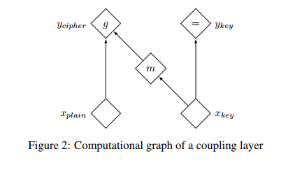

**生成模型三大任务**

* inference: 计算 $z=f(x)$
* sample:  计算 $x = g(z)$
* density-estimation: 计算 $p(x)$

|                     | inference | sample | density-estimation | train |
| ------------------- | --------- | ------ | ------------------ | ----- |
| NICE                | 可并行       | 可并行    | 可并行                | 可并行   |
| realNVP             | 可并行       | 可并行    | 可并行                | 可并行   |
| Glow                | 可并行       | 可并行    | 可并行                | 可并行   |
| Autoregressive Flow | 可并行       | 串行     | 可并行                | 可并行   |
| IAF                 | 串行        | 可并行    |                    |       |

# Deep reversible nets

**什么是 deep reversible nets**

* 神经网络代表一个函数，这个函数是可逆的。
* i.e. : $y = f(x), x = f^{-1}(y)$ 
* 但是目前常用的网络如同 VGG, AlexNet, resnet, etc . 都是不可逆的

**reversible 性质有什么好处**

* 可以用上概率论中的一个公式 $p(y) = p\Bigr(g(y)\Bigr)\Biggr|\text{det}(\frac{d g(y)}{dy})\Biggr|$
* $y = f(z), z = g(y), g = f^{-1} $ 
* 如果想要知道 $p(y)$ , 只需要用上面的公式计算出来就可以了。
* 可以使用 极大似然来计算 $p(x)$ 了

**reversible 用在哪**

* VAE
* 生成模型

**reversible net的难点**

* 如何设计一个 reversible net (逆好算，det也好求)

**代表论文**

[NICE: Non-linear Independent Components Estimation](https://arxiv.org/abs/1410.8516)

## NICE: non-linear independent components estimation

> a good representation is one in which the data has a distribution that is **easy to model**
>
> * 所以就假设 $p(\mathbb z)=\prod_{i=1}^D p(z_i)$ 
>
> instead of modeling directly complex data by learning over a complex parametric family of distributions, we will learn a non-linear transformation of the data distribution into a simpler distribution via maximum likelihood.

* 这个结构是可逆的，而且 det 也好求。

## Density Estimation Using Real NVP

[一个 summary](http://www.shortscience.org/paper?bibtexKey=journals/corr/1605.08803)

> VAE: maximizing a variational lower bound on the log-likelihood
>
> GAN: 无法获得 样本的概率值。

* 将 CNN 和 batch-norm 引入了

## Glow: Generative Flow with Invertible 1*1 Convolutions

* 比 realNVP 多了个 1×1 的卷积层。
* channel 之间的信息交互的更加有效

## Masked Autoregressive Flow for Density Estimation

**自回归模型**
$$
p(\mathbb x) = \prod_{d=1}^D p(\mathbb x_{d}|\mathbb x_{<d})
$$
**采样过程**
$$
\mathbb x_i = \mathbb z_i* \sigma_i + \mu_i
$$

$$
\mu_i=f_{\mu_i}(\mathbb x_{1:i-1}), \sigma_i=f_{\sigma_i}(\mathbb x_{1:i-1}),  \mathbb z_i\sim N(0,1)
$$

* 可以看出，采样的过程是序列的

**推断过程，（和 density estimation 是差不多的）**
$$
\mathbb z_i = (\mathbb x_i-\mu_i) / \sigma_i
$$

$$
\mu_i=f_{\mu_i}(\mathbb x_{1:i-1}), \sigma_i=f_{\sigma_i}(\mathbb x_{1:i-1})
$$

* 可以看出，给定 $\mathbb x$ ，这个式子完全可以并行。

## IAF

* density estimation 的时候比较慢
* sampling 的时候挺快的

**逆自回归流**

**采样过程，（即自回归流的 推断过程）**
$$
\mathbb x_i = (\mathbb z_i-\mu_i) / \sigma_i
$$

$$
\mu_i=f_{\mu_i}(\mathbb z_{1:i-1}), \sigma_i=f_{\sigma_i}(\mathbb z_{1:i-1}), \mathbb z_i \sim N(0,1)
$$

* 此过程可并行

**推断过程，（即自回归流的 采样过程）**
$$
\mathbb z_i = \mathbb x_i* \sigma_i + \mu_i
$$

$$
\mu_i=f_{\mu_i}(\mathbb z_{1:i-1}), \alpha_i=f_{\alpha_i}(\mathbb z_{1:i-1})
$$

* 可以看出，需要串行。
* 所以做 **density estimation** 非常慢。

**re-parameterize**

* 如果直接用上面方式**建模采样过程**的话，可能会有些问题，如果 $\sigma_i=0$ ，就 GG了。 

所以，进行 re-parameterize trick 之后，采样过程可以写成下面这种形式
$$
\mathbb x_i = \mathbb z_i * \sigma_i +\mu_i 
$$

$$
\mu_i=f_{\mu_i}(\mathbb z_{1:i-1}), \sigma_i=f_{\sigma_i}(\mathbb z_{1:i-1}), \mathbb z_i \sim N(0,1)
$$

