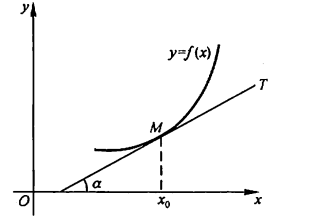
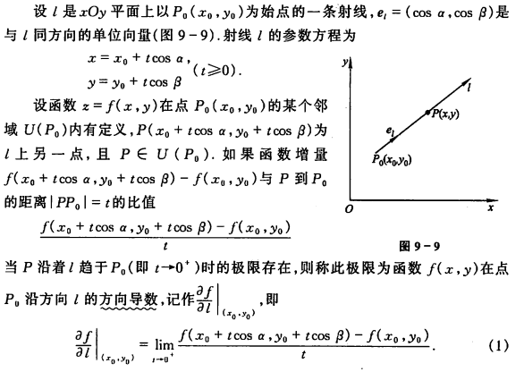
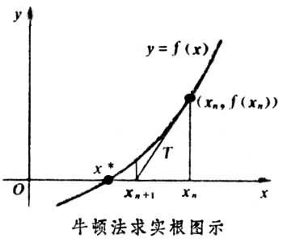
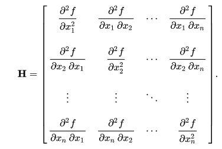
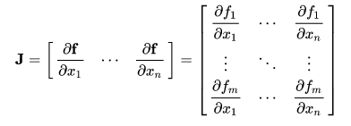

# 优化方法--牛顿法

## 梯度

导数的定义（斜率）：
$$
\lim_{x\rightarrow x_0} \frac{f(x)-f(x_0)}{x-x_0}
$$
几何意义为：$f'(x) = \tan(\alpha)$

**为什么梯度是loss下降最快的方向**

方向导数：函数延任意指定方向的变化率问题，**方向导数是标量**

定理：
$$
\frac{\partial f}{\partial l}\Bigr|_{x_0,y_0} = f_x(x_0,y_0)\cos\alpha+f_y(x_0,y_0)\cos\beta
$$

* 其中， $\cos\alpha, \cos\beta$ 是方向 $l$ 的方向余弦，就是单位方向向量。

**梯度是向量：梯度是下降最快的方向**
$$
grad = f_x(x_0,y_0)\mathbf i+f_y(x_0,y_0)\mathbf j
$$

所以说，**梯度是下降最快的方向**

## 牛顿法

牛顿法可以用在以下两个方面：

* 求解方程的跟 $f(x)=0, x=?$
* 最优化问题

**求解方程的根**
$$
\begin{aligned}
f(x) &\approx f(x_0)+f'(x_0)*(x-x_0) \\
f(x)=0 &\Leftarrow\Rightarrow  f(x_0)+f'(x_0)*(x-x_0) \\
&\Rightarrow x=x_0-\frac{f(x_0)}{f'(x_0)}
\end{aligned}
$$

$ x=x_0-\frac{f(x_0)}{f'(x_0)}$ 只是一个近似解，但是通过不停的迭代这个式子$ x_{t+1}=x_t-\frac{f(x_t)}{f'(x_t)}$，最终会收敛 !!!

**最优化**

方程的根的问题是 求 $f(x)=0$ 的问题，最优化的问题是求 $f'(x)=0$ 的问题,即：$f'(x)$ 的根。其中
$$
\begin{aligned}
f'(x) &\approx f’(x_0)+f''(x_0)*(x-x_0) \\
f'(x)=0 &\Leftarrow\Rightarrow  f'(x_0)+f''(x_0)*(x-x_0) \\
&\Rightarrow x=x_0-\frac{f'(x_0)}{f''(x_0)}
\end{aligned}
$$

不停的迭代这个式子$ x_{t+1}=x_t-\frac{f'(x_t)}{f''(x_t)}$，最终会收敛 !!!

在高维情况下，牛顿迭代公式是：
$$
x_{t+1} = x_t - \Bigr[H_{f(x_t)}\Bigr]^{-1}f'(x_t)
$$

由于 hessian-matrix 的逆很难求，所以很多情况下都是估计hessian矩阵的逆，然后再用牛顿法求解最优值。

**总结：**

* 可以看出，牛顿法实际上并不是直接求 $f(x)=0, f'(x)=0$ 的解，而是通过将其泰勒展开，求展开的公式的解（即：估计的值的解）。
* 牛顿法解决了原始梯度下降方法的 step 如何确定的问题.

## quasi-newton

由于牛顿法中的 hessian 矩阵的逆不好计算，所以拟牛顿法的基本思想就是，用一个 N-阶矩阵 $G(x_t)$ 近似代替 $H(x_t)^{-1}$ . $\mathbf h_t$ 代表更新方向：
$$
\mathbf h_t = -\mathbf H^{-1}(x_t) f'(x_t) \Rightarrow -\mathbf G(x_t)f'(x_t)
$$
基本的步骤可以总结如下：

1. 对最优值点进行一个初始化假设 $\mathbf x_0$ , 初始化 $\mathbf G_0=\mathbf I$ 
2. 计算 $f'(x_t)$ ，然后选择 search direction $\mathbf h_t=-\mathbf G_tf'(x^t)$
3. 以 $\mathbf h_t$ 为方向，对 $\mathbf x_t$ 进行 line search，即： $\min_t f(x_t+k*h_t)$ , 然后进行更新，计算 $x_{t+1}$
4. 通过合适的修改 $\mathbf G_t$ 得到 $\mathbf G_{t+1}$ , 然后设置 $t=t+1$ ,转到 step 2 继续执行。

**quasi-newton condition**
$$
\mathbf x_{i+1} - \mathbf x_i = \mathbf G_{i+1} \Bigr(f'(\mathbf x_{i+1})-f'(\mathbf x_i)\Bigr)
$$

> 可以看出，求解还是$f'(x)$ 泰勒一阶展开的最优值, 估计的值。

## 雅克比矩阵

## 参考资料

[http://jacoxu.com/jacobian%E7%9F%A9%E9%98%B5%E5%92%8Chessian%E7%9F%A9%E9%98%B5/](http://jacoxu.com/jacobian%E7%9F%A9%E9%98%B5%E5%92%8Chessian%E7%9F%A9%E9%98%B5/)

http://www.princeton.edu/~yc5/ele522_optimization/lectures/quasi_Newton.pdf

