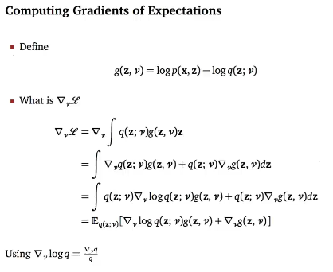

## Recipe

* **Start with a model**

$$
p(\mathbb z, \mathbb x)
$$

* **Choose a variational approximation**

$$
q(\mathbb z; v)
$$

* **Write down the  ELBO**

$$
L(v) = \mathbb E_{q(z;v)}\Bigr[\log p(\mathbb x, \mathbb z)-\log q(\mathbb z; v)\Bigr]
$$

* **Compute the expectation** : For Example
  * Derive a model specific bound
  * If the **expectation is intractable, we are stuck.**
  * More general approximations that require model-specific analysis

$$
L(v) = xv^2 + \log v
$$

* **Take derivatives**: For Example

$$
\nabla_v L(v)=2xv + \frac{1}{v}
$$

* **Optimize using some optimizer. Adam, SGD, etc**

**如果 expectation 不好算怎么办？**
$$
\int q(\mathbb z; v) f(\mathbb x, \mathbb z) d\mathbb z
$$

**交换一下积分和求导的顺序，求导在前，积分在后！！！！**

* 尝试 **采样估计梯度的积分**

**小 demo 一个**

**注意！！！！！！！！！**
$$
\mathbb E_{q(\mathbb z; v)} \Bigr[\nabla_vg(\mathbb z, v)\Bigr] = 0
$$

* 可以约掉。

