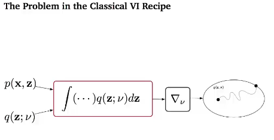
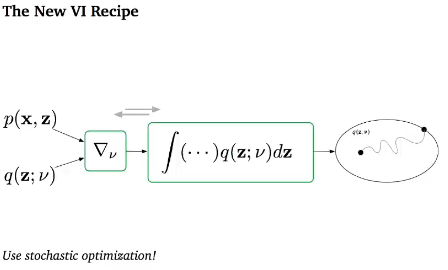
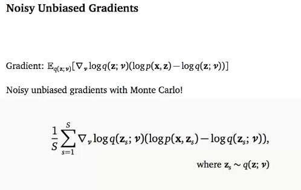
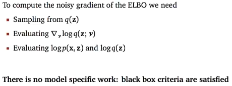

## Recipe (Stochastic Variational Inference)

* **Start with a model**

$$
p(\mathbb z, \mathbb x)
$$

* **Choose a variational approximation**

$$
q(\mathbb z; v)
$$

* **Write down the  ELBO**

$$
L(v) = \mathbb E_{q(z;v)}\Bigr[\log p(\mathbb x, \mathbb z)-\log q(\mathbb z; v)\Bigr]
$$

* **Compute the expectation** : For Example
  * If the **expectation is intractable, we are stuck.**
    * Derive a model specific bound
    * More general approximations that require model-specific analysis

$$
L(v) = xv^2 + \log v
$$

* **Take derivatives**: For Example

$$
\nabla_v L(v)=2xv + \frac{1}{v}
$$

* **Optimize using some optimizer. Adam, SGD, etc**

**对于 Stochastic Variational Inference 来说，先对 ELBO 求积分，得到一个 closed-form 的数学表达式，然后再对这个表达式求导。 但是一旦 ELBO 的积分求不出来一个 closed-form 的表达式，这就很痛苦了。**

##  Black Box Variational Inference 

**如果 expectation 不好算怎么办？**
$$
\int q(\mathbb z; v) f(\mathbb x, \mathbb z) d\mathbb z
$$

**交换一下积分和求导的顺序，求导在前，积分在后！！！！**

* 直接对积分进行求导，然后再化简成 积分的形式。**使用一个 log-prob trick**

* 尝试 **采样估计梯度的积分**

**小 demo 一个**

**注意！！！！！！！！！**
$$
\mathbb E_{q(\mathbb z; v)} \Bigr[\nabla_vg(\mathbb z, v)\Bigr] = 0
$$

* 可以约掉。

* 其中 $\log p(x, z) = \log p(x|z) + \log p(z)$ : $p(z)$ 为先验, $p(x|z)$ 为条件概率(生成模型)
* noisy unbiased gradient with Monte Carlo
  * 因为存在 $z_s \sim q(z;v)$ 采样，所以叫 Monte Carlo

**在写代码的时候，我们要将 Gradient 计算公式显示的写出来，然后通过头梯度的形式传入神经网络，进行参数更新。**

## Basic BBVI doesn't Work

* Control Variants

## Pathwise Gradients of the ELBO

**对 ELBO 进行 re-parameterization trick**

* 然后就可以从简单分布中采样 $\varepsilon \sim N(0,1)$ ，然后计算 ELBO 的值，然后直接对 ELBO backward就可以了。就不用计算头梯度了。（**这种代码估计就需要多次前向过程了。有点麻烦。**）
* 或者通过 Monte Carlo 的方法估计 头梯度。**感觉这种代码更好写**

