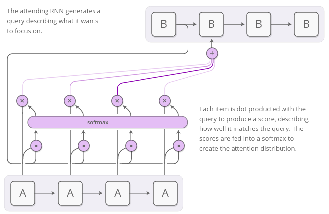

# Attention

## 基本想法

* 将 句子 中的每个单词都编码成一个向量
* 当解码的时候，通过 `attention weights` 来对这些向量进行线性组合
* 使用 线性组合后的向量来帮忙挑选下一个 词。

## attention 的三个基本元素

* `query`
* `key vectors`
* `value vectors`

`query` 与 `key vectors` 用来计算 `attention weights`， 然后用计算后的 `attention weights` 来线性组合 `value vectors`。 `attention weights` 的和为 `1` 。

## 计算 attention score 的几种方法

> attention score 归一化之后才是 attention weights

$\mathbf q$ 是 query， $\mathbf k$ 是 key。

**方法一**

* Multi-layer Perceptron (Bahdanau et al. 2015)

$$
a(\mathbf q, \mathbf k) = v_a^T\tanh(W_a[\mathbf q; \mathbf k])
$$

**方法二**

* Bilinear (Luong et al. 2015)

$$
a(\mathbf q, \mathbf k) =\mathbf q^TW \mathbf k
$$
**方法三**

* Dot product (Luong et al. 2015)

$$
a(\mathbf q, \mathbf k) =\mathbf q^T \mathbf k
$$

**方法四**

* Scaled Dot Product (Vaswani et al. 2017)

$$
a(\mathbf q, \mathbf k) =\frac{\mathbf q^T \mathbf k}{\sqrt{|\mathbf k|}}
$$

## 论文阅读

### NEURAL MACHINE TRANSLATION BY JOINTLY LEARNING TO ALIGN AND TRANSLATE

**第一种 attention**

### Long Short-Term Memory-Networks for Machine Reading (self attention / intra attention)

**sequence-level networks 面对的三大挑战**

* 模型训练问题，梯度消失，梯度爆炸
  * LSTM 可以部分解决梯度消失问题，梯度爆炸可以用 clip-gradient 方法来解决
* 内存压缩问题
  * 由于 输入 句子 被压缩 融合进 **一个** 稠密向量中，所以需要大量的内存容量来存储过去的信息，这就会导致一个问题：对于长句子，内存的能力不够，对于短句子，浪费 内存能力
* sequence-level networks lack a mechanism for handling the structure of the input。 但是 语言是有结构的

**本文提出来的模型就是为了解决，内存表示能力不足和 LSTM 无法处理 输入序列的 结构化信息 这两个问题**

* 将 `memory cell` 替换成 `memory network` 
* The resulting Long Short-Term Memory-Network (LSTMN) stores the **contextual representation of each input token** with a unique memory slot and the size of the memory grows with time until an upper bound of the memory span is reached.

**LSTMN**

The model maintains two sets of vectors stored in a hidden state tape used to interact with the environment (e.g., computing attention), and a memory tape used to represent what is actually stored in memory.

## 参考资料

[https://distill.pub/2016/augmented-rnns/](https://distill.pub/2016/augmented-rnns/)

