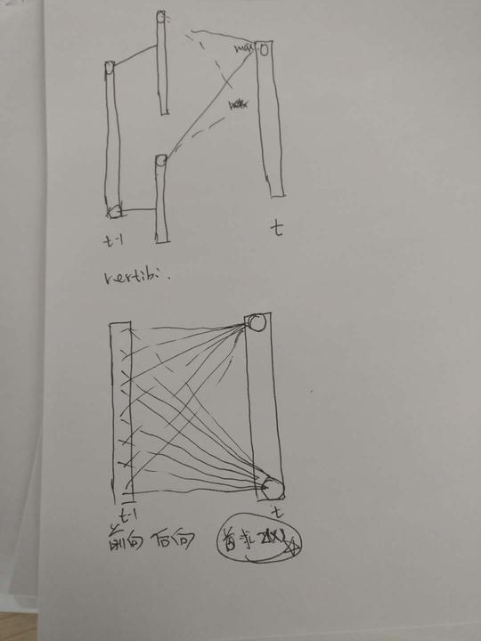

# 对自然语言处理中的一些解码器的总结与思考

## RNN decoder

`RNN-decoder` 出现在 `seq2seq` 模型中，用数学可以表示为：
$$
y_t = \text{RNN}(h_t, [y_{t-1}, c_t])
$$

* $y_t$ ： `t` 时刻的解码结果
* $h_t$ ： `t` 时刻的隐状态
* $c_t$ ：这个就随便了，可以是 `attention` 的结果，也可以是其它

`RNN decoder` 是一个 `greedy decoder` ，每个 `time-step` 都选择**当前得分最高的当作结果**，**然后将当前的结果输入下一步**，丝毫不考虑是不是全局最优，所以 `RNN decoder` 解码出来的结果并不是最优解。

## Viterbi decoder

这个经常出现在概率图模型的解码中，**HMM, CRF** 这些。

`vertibi decoder` 得到的结果是最优结果（厉害吧）。

`vertibi decoder` 使用动态规划算法可以很快的求解出最优路径，听到动态规划是有点可怕（核心思想时，最优路径的**子路径**也是最优的！！！）。但是直接看算法的话是非常直观的：从图中可以看出，算法复杂度为 $\text{T*|V|}^2$

## Beam Search

在翻译任务中，如果 `Vocab` 非常大，那么使用 `viterbi` 算法进行 `decode` 速度依旧是非常慢的时间复杂度为 $\text{T*|V|}^2$，`beam search` 选择了一种折中的方式，将时间复杂度降低为 $\text{T*|V|*Beamwidth}$ , 但结果就不是最优的了。

## 深度学习与CRF

现在`(2018.04.27) ` 许多深度学习与 CRF 结合的模型都是：

* `RNN decoder` 输出 `emission score`
* 创建一个 `transition-param` 参数用来学习 状态之间的 `transition` 信息。`RNN decoder` 就损失了这个玩意。
* 有了 `emission score` 和 `transition-param` 就可以假装成 `CRF` 了，

**思考：**

* 这里有一个点就是，能不能用 `RNN` 来建模 `transition` 信息，而不是一个简单的参数。
* 如何将 CRF 思想用在 NMT 任务上。

