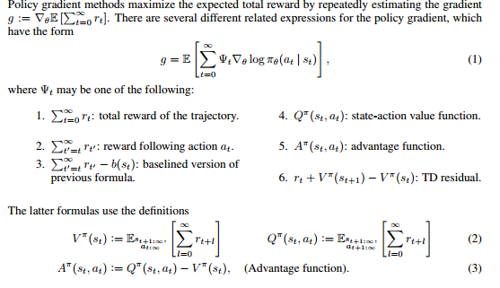

# High Dimensional Continuous Control Using Generalized Advantage Estimation

大神文章，前来拜读

**key word**

* Policy Gradient
* model free
* ​

## 文章阅读

**Policy Gradient 算法的两大挑战**

* requiring  a large number of samples
* difficulty of obtaining  stable and steady improvement despite the non-stationarity of the incoming data.

> We address the **first challenge** by using value functions to substantially reduce the variance of policy gradient estimates at the cost of some bias, with an exponentially-weighted estimator of the advantage function that is analogous to TD(λ).

为什么就能解决了第一个问题了？  不了解。。。。。

> We address the second challenge by using trust region optimization procedure for both the policy and the value function, which are represented by neural networks.

用 trust region 那一套 的确能解决单调性问题。

**Introduction**

> this paper considers algorithms that optimize a parameterized policy and use value functions to help estimate how the policy should be improved.

文章关注的算法特点：

* parameterized policy
* using value function to help estimate how the policy should be improved.

>  the variance of the gradient estimator scales unfavorably with the time horizon, since the effect of an action is confounded with the effects of past and future actions. 

这句话是什么鬼意思？？？？？

> But while high variance necessitates using more samples, bias is more pernicious—even with an unlimited number of samples, bias can cause the algorithm to fail to converge, or to converge to a poor solution that is not even a local optimum.

如果梯度的估计存在很大方差的话，需要很多样本才能收敛。如果梯度的估计有不可忍受的 bias 的话，有再多的样本也救不回来了。

**Policy Gradient 算法**

