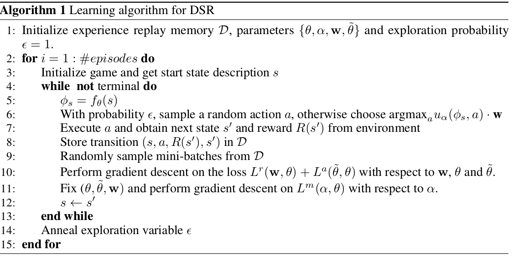

# Hierarchical Learning

## Deep Successor Reinforcement Learning

> Learning robust value functions given raw observations and rewards is now possible with model-free and model-based deep reinforcement learning algorithms. There is a third alternative, called Successor Representations(SR).

* model-free
* model-based
* successor representation

> Successor Representation which decomposes the value function into two components:
>
> * a reward predictor
> * a successor map
>   * represent the **expected future state occupancy from any given state** and the **reward predictor maps states to scalar rewards**. 
>
> The value function can be computed as the **inner product between the successor map** and the **reward weights**.

这里需要注意的是：是 reward predictor， 这个模型的意思是打算搞 reward 了

> The value function at a state can be expressed as the dot product between the **vector of expected discounted future state occupancies** and the **immediate reward** in each of those successor states.

**Introduction**

SR's appealing properties:

* combine computational efficiency comparable to model-free algorithms with some of the flexibility of model-based algorithms   ??????
* SR can adapt quickly to changes in distal reward, unlike model-free algorithms ?????

**关于这篇文章的问题：**

* $m_{sa}\cdot \mathbf w$ 用来表示 $Q(s,a)$ , $\phi_s\cdot \mathbf w$ 来表示 $R(s)$ , 至少也得是表示  $R(s,a)$ 吧！！！！

$$
Q^\pi(s,a) = \sum_{s'\in S}M(s,s',a)R(s') \tag1
$$

* 感觉 (1) 式是有问题的，MDP 的reward 是 $R(s,a)$ 啊，咋就变成了 $R(s)$

* 用 $R(s,a)$ 来表示 $R(s')$ ??????

## Hierarchical Deep RL: Integrating Temporal Abstraction and Intrinsic Motivation

**abstract**

> Learning goal-directed behavior in environment with sparse feedback is a major challenge for reinforcement learning algorithms.
>
> The primary difficulty arises due to **insufficient exploration**, result in an agent being unable to learn **robust value functions**.
>
> **Intrinsic motivated** agents can explore new behavior for its own sake rather than to directly solve problems.
>
> hierarchical-DQN, a framework to integrate 
>
> * hierarchical value functions, operating at different time-scales, 
> * with intrinsically motivated deep reinforcement learning.
>
>
>
> * a Top-level value function learns a policy over intrinsic goals, and
> * a lower-level function learns a policy over atomic actions to satisfy the given goals
>
> 适用环境：
>
> * vary sparse, delayed feedback

**Introduction**

> we propose  a framework that integrates 
>
> * deep reinforcement learning with 
> * hierarchical value functions.
>
> where the agent is motivated to solve intrinsic goals (via learning options) to aid exploration.

> Recently, value functions have also been generalized as $V(s,g)$ in order to represent the utility of state $s$ for achieving a given goal $g\in G$ .

* $V(s,g)$ 用来表示，g 作为目标的值函数， 而不是基本的，$V(s)$ 代表到达终止状态的值函数
* 也可以表述为：$g$ 作为 $V(s,g)$ 的终止状态，作为我们的目标

> When the environment provides delayed rewards, we adopt a strategy to first learn ways to achieve intrinsically generated goals and subsequently learn an optimal policy to chain them together.

* 就像，直接告诉你，你去变成一个成功人士，这很难，因为你要从广大的空间中去搜索成为成功人士所必须经过的路径。
* 但是，这时候，有些人告诉你成功人士修炼路径上的几个 关键点，让你先达到这些关键点，然后在成为成功人士，这就简单的多了。可选的路径瞬间就下降了好几个数量级。
* 问题在于：如何获得中间这几个关键点

> a collection of these polices can be hierarchically arranged with temporal dynamics for learning or planning within the framework semi-Markov decision process.

> We propose a framework with hierarchically organized deep reinforcement learning modules working **at different time-scales.** The model takes decisions over TWO levels of hierarchy:
>
> * top level module (*meta-controller*) takes in the state and picks a new goal
> * the lower level module (*controller*) uses both the state and the chosen goal to select actions either until the goal is reached or the episode is terminated.

* at different time-scales 指的是啥
  * meta-controller 和 controller 作用的时间范围不同

**Literature Review**

* semi-MDP

> Using a notion of "salient events" as sub-goals.

> DQNs have been successfully applied to various domains including Atari games and GO, but still perform poorly on environments with **sparse, delayed reward signals.** 
>
> Strategies such as **prioritized experience replay and bootstrapping** have been proposed to alleviate the problem of learning from sparse rewards.

* sparse reward 用这两个算法还是没啥用
* prioritized experience 怎么解决 sparse reward 问题的？？？？

> Core knowledge

**Model**

> we utilize a notion of *goals* $g\in \mathcal G$, which provide intrinsic motivation for the agent.
>
> The agent focuses on setting and achieving sequences of goals in order to maximize cumulative extrinsic reward.

* controller：给定 goal ，他去最大化 intrinsic cumulative reward
* meta-controller : 选择 goal

## Option Discovery in Hierarchical Reinforcement Learning using Spatial-Temporal Clustering

## 关于 Long-Range 的问题解决方法

* 给 agent 先设定一个小目标
* 用 tree-search 方法

## Questions

* ​

## Glossary

* state occupancy
* enable exploration at different time-scales
* goal-directed behavior 
* multiple-level spatial-temporal abstraction 
* intrinsic reward
* extrinsic reward : 