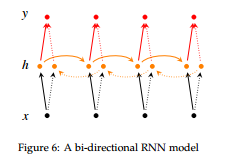
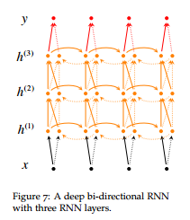

# tensorflow 双向 rnn
如何在tensorflow中实现双向`rnn`

## 单层双向rnn
<center></center>
<center>单层双向rnn (cs224d)</center>
`tensorflow`中已经提供了双向`rnn`的借口,它就是`tf.nn.bidirectional_dynamic_rnn()`. 我们先来看一下这个接口怎么用.
```python
bidirectional_dynamic_rnn(
    cell_fw, #前向 rnn cell
    cell_bw, #反向 rnn cell
    inputs, #输入序列.
    sequence_length=None,# 序列长度
    initial_state_fw=None,#前向rnn_cell的初始状态
    initial_state_bw=None,#反向rnn_cell的初始状态
    dtype=None,#数据类型
    parallel_iterations=None,
    swap_memory=False,
    time_major=False,
    scope=None
)
```
返回值:一个tuple(outputs, outputs_states), 其中,`outputs`是一个tuple(outputs_fw, outputs_bw). 关于`outputs_fw`和`outputs_bw`,如果`time_major=True`则它俩也是`time_major`的,vice versa. 如果想要`concatenate`的话,直接使用`tf.concat(outputs, 2)`即可.


**如何使用:**
bidirectional_dynamic_rnn 在使用上和 dynamic_rnn是非常相似的.
1. 定义前向和反向rnn_cell
2. 定义前向和反向rnn_cell的初始状态
3. 准备好序列
4. 调用`bidirectional_dynamic_rnn`
```python
import tensorflow as tf
from tensorflow.contrib import rnn
cell_fw = rnn.LSTMCell(10)
cell_bw = rnn.LSTMCell(10)
initial_state_fw = cell_fw.zero_state(batch_size)
initial_state_bw = cell_bw.zero_state(batch_size)
seq = ...
seq_length = ...
(outputs, states)=tf.nn.bidirectional_dynamic_rnn(cell_fw, cell_bw, seq,
 seq_length, initial_state_fw,initial_state_bw)
out = tf.concat(outputs, 2)
# ....
```

## 多层双向rnn
<center></center>
<center>多层双向rnn(cs224d)</center>

单层双向rnn可以通过上述方法简单的实现,但是多层的双向rnn就不能使将`MultiRNNCell`传给`bidirectional_dynamic_rnn`了.
想要知道为什么,我们需要看一下`bidirectional_dynamic_rnn`的源码片段.
```python
with vs.variable_scope(scope or "bidirectional_rnn"):
  # Forward direction
  with vs.variable_scope("fw") as fw_scope:
    output_fw, output_state_fw = dynamic_rnn(
        cell=cell_fw, inputs=inputs, sequence_length=sequence_length,
        initial_state=initial_state_fw, dtype=dtype,
        parallel_iterations=parallel_iterations, swap_memory=swap_memory,
        time_major=time_major, scope=fw_scope)
```
这只是一小部分代码,但足以看出,`bi-rnn`实际上是依靠`dynamic-rnn`实现的,如果我们使用`MuitiRNNCell`的花,那么每层之间不同方向之间交互就被忽略了.**所以我们可以自己实现一个工具函数,通过多次调用`bidirectional_dynamic_rnn`来实现多层的双向RNN**

## bidirectional_dynamic_rnn源码一探
上面我们已经看到了正向过程的代码实现,下面来看一下剩下的反向部分的实现.
其实反向的过程就是做了两次`reverse`
1. 第一次`reverse`:将输入序列进行`reverse`,然后送入`dynamic_rnn`做一次运算.
2. 第二次`reverse`:将上面`dynamic_rnn`返回的`outputs`进行`reverse`,保证正向和反向输出的`time`是对上的.

```python
def _reverse(input_, seq_lengths, seq_dim, batch_dim):
  if seq_lengths is not None:
    return array_ops.reverse_sequence(
        input=input_, seq_lengths=seq_lengths,
        seq_dim=seq_dim, batch_dim=batch_dim)
  else:
    return array_ops.reverse(input_, axis=[seq_dim])

with vs.variable_scope("bw") as bw_scope:
  inputs_reverse = _reverse(
      inputs, seq_lengths=sequence_length,
      seq_dim=time_dim, batch_dim=batch_dim)
  tmp, output_state_bw = dynamic_rnn(
      cell=cell_bw, inputs=inputs_reverse, sequence_length=sequence_length,
      initial_state=initial_state_bw, dtype=dtype,
      parallel_iterations=parallel_iterations, swap_memory=swap_memory,
      time_major=time_major, scope=bw_scope)

output_bw = _reverse(
  tmp, seq_lengths=sequence_length,
  seq_dim=time_dim, batch_dim=batch_dim)

outputs = (output_fw, output_bw)
output_states = (output_state_fw, output_state_bw)

return (outputs, output_states)
```

## tf.reverse_sequence
```python
reverse_sequence(
    input,#输入序列,将被reverse的序列
    seq_lengths,#1Dtensor,表示输入序列长度
    seq_axis=None,# 哪维代表序列
    batch_axis=None, #哪维代表 batch
    name=None,
    seq_dim=None,
    batch_dim=None
)
```
官网上的例子给的非常好,这里就直接粘贴过来:
```python
# Given this:
batch_dim = 0
seq_dim = 1
input.dims = (4, 8, ...)
seq_lengths = [7, 2, 3, 5]

# then slices of input are reversed on seq_dim, but only up to seq_lengths:
output[0, 0:7, :, ...] = input[0, 7:0:-1, :, ...]
output[1, 0:2, :, ...] = input[1, 2:0:-1, :, ...]
output[2, 0:3, :, ...] = input[2, 3:0:-1, :, ...]
output[3, 0:5, :, ...] = input[3, 5:0:-1, :, ...]

# while entries past seq_lens are copied through:
output[0, 7:, :, ...] = input[0, 7:, :, ...]
output[1, 2:, :, ...] = input[1, 2:, :, ...]
output[2, 3:, :, ...] = input[2, 3:, :, ...]
output[3, 2:, :, ...] = input[3, 2:, :, ...]
```
例二:
```python
# Given this:
batch_dim = 2
seq_dim = 0
input.dims = (8, ?, 4, ...)
seq_lengths = [7, 2, 3, 5]

# then slices of input are reversed on seq_dim, but only up to seq_lengths:
output[0:7, :, 0, :, ...] = input[7:0:-1, :, 0, :, ...]
output[0:2, :, 1, :, ...] = input[2:0:-1, :, 1, :, ...]
output[0:3, :, 2, :, ...] = input[3:0:-1, :, 2, :, ...]
output[0:5, :, 3, :, ...] = input[5:0:-1, :, 3, :, ...]

# while entries past seq_lens are copied through:
output[7:, :, 0, :, ...] = input[7:, :, 0, :, ...]
output[2:, :, 1, :, ...] = input[2:, :, 1, :, ...]
output[3:, :, 2, :, ...] = input[3:, :, 2, :, ...]
output[2:, :, 3, :, ...] = input[2:, :, 3, :, ...]
```

## 参考资料
[https://cs224d.stanford.edu/lecture_notes/LectureNotes4.pdf](https://cs224d.stanford.edu/lecture_notes/LectureNotes4.pdf)
[https://www.tensorflow.org/api_docs/python/tf/reverse_sequence](https://www.tensorflow.org/api_docs/python/tf/reverse_sequence)
